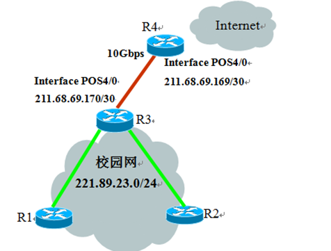
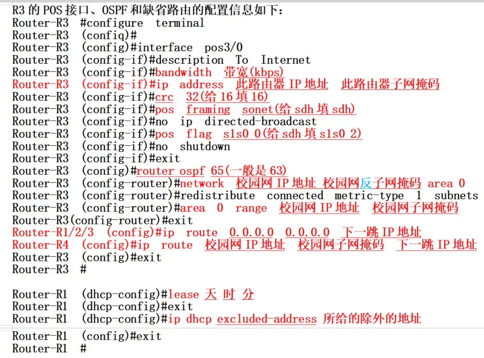
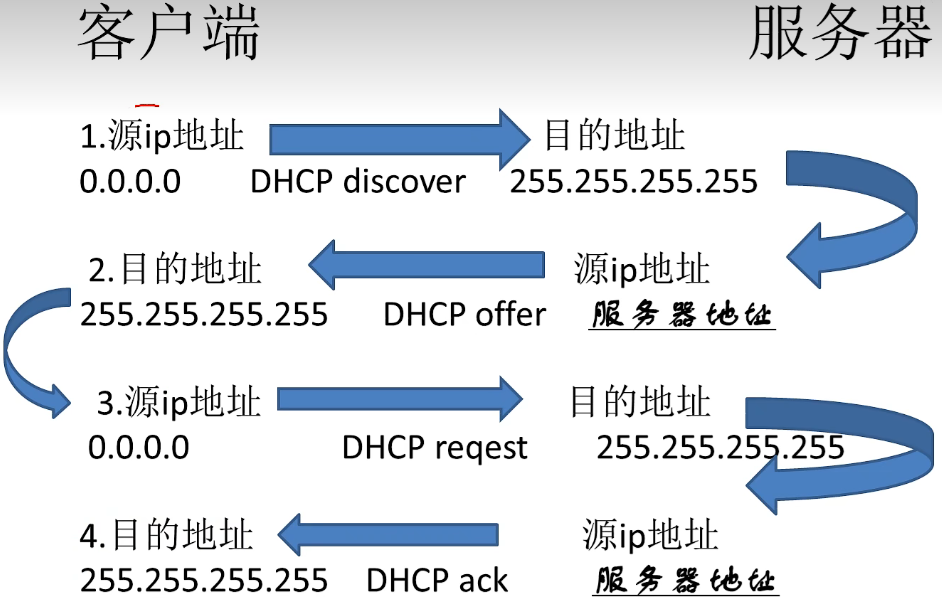
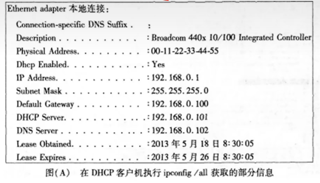
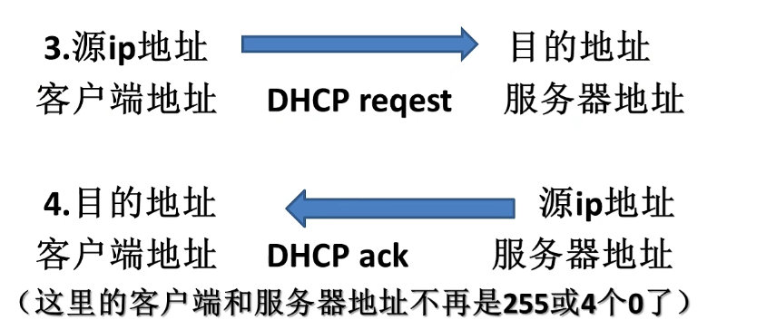
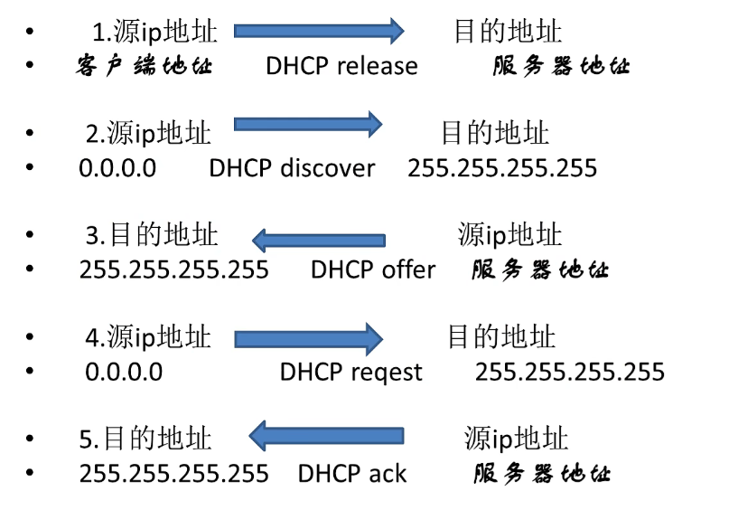
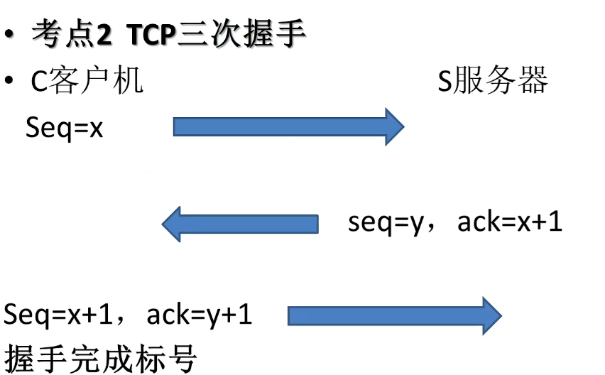

## 大题第一道 ip 表格

#### 地址类别

- A类 `1-127`
- B类 `128-191`
- C类 `192-223`

#### 受限广播地址

`255.255.255.255`

#### 网络地址

Ip地址 & 子网掩码

#### 直接广播地址

网络位不变， 主机位置一

#### 主机号

网络位置零，主机位不变

#### 子网内第一个IP地址

网络地址 + 1

#### 最后一个IP地址

直接广播地址 - 1


##### 举例

125.175.20.7 / 255.224.0.0

A 类  255.255.255.255  网络地址：125.160.0.0 125.  直接：125.191.255.255 主机号 0.15.20.7 子网内第一个: 125.160.0.1 最后一个125.191.255.254


## 第二个大题 cisco 交换机


#### 进入系统

Switch-6500> **enable**

#### 设置 vlan

set vlan  **线上连接的计算机的ID号** **线旁的标示（分数）** 

一般情况下有两个，注意按照设置ID的顺序的顺序

例如 set vlan 130 5/2

#### 设置 trunk

set trunk **线上的标示 on dot1q(协议对应名字)**

set trunk **线上的标示 vlan 所有的VLAN ID 号（中间又逗号）**

例如: set trunk 3/8 vlan 130,222

### 设置域名

**set vtp domain 域名**

例如：set vtp domain pku

### 建立VLAN

**vlan <vlan_ID> name** 

例如: vlan 100 name vlan10

### 删除Vlan

**clear vlan VLAN_ID**

### 分配VLAN

**switchport access vlan vlan_ID** 

### Vlan trunk的配置

#### 交换机端口配置模式下设置交换机端口的Vlan Trunk

**switchport mode trunk**

#### 封装Vlan协议

- IEEE标准用 **switchport trunk encapsulation dot1q**
- ISL协议用 **switchport trunk encapsulation isl**
- 自动协商 **switchport trunk encapsulation negotiate P**

#### 设置VLAN Trunk允许中继的Vlans

**swtichport trunk allowed vlan ID**


## 第二个大题 DHCP设置

### excluded-address

ip dhcp **excluded-address** **IP1 IP2**

IP1 和 IP2 由题目给出

### 自己ip地址

**network** ip地址 子网掩码

### poolname

**ip dhcp pool <地址池名称>**

### ip test

ip **dhcp pool test**

### 默认网关

**default-router** **IP**

### DNS

**dns-server** **address IP1 IP2**

域名服务器并且两个IP地址用空格隔开


## 第二题 校园网连接




#### ip route 

##### 校园网内的路由器 R1, R2 ,R3

`ip route 0.0.0.0 0.0.0.0  下一跳路由器地址`

##### 校园网外的路由器R4

`ip route 校园网ip地址 校园网子网掩码 下一跳路由器`

##### 例子

```router
Router-R2 (config)  #ip route 0.0.0.0 0.0.0.0 211.68.29.170
Router-R4 (config)  #ip route 211.68.69.169 255.255.255.252 211.68.69.170
```

#### crc 

`crc 32` 题目要是给定16 就填16 不然填32 或者crc

#### bandwidth 

bandwidth __带宽(kps) __

- 1GPS = 1000MBps = 1000000kps 

##### 例子

`Router-R3 (config) bandwidth 10000000`

#### ip address

**看清是路由器的还是题目上的**

Ip address **这个路由器的Ip地址**  **这个路由器的子网掩码**

##### 例子

`Router-R3 (config-if) #ip address 202.112.8.198 255.255.255.252`

####  pos framing

- POS接口的帧格式是 SONET/sdh

pos **framing** **sdh/sonet** (具体看题目要求)

#### pos flag 

Pos flag **s1s0 0**(给出SONET) /  **s1s0 2**(给出sdh)

#### lease 

Lease **天** **小时** **分钟**

#### network area

如果有两个IP地址，注意子网聚合后再填写并且以此作为校园网的IP地址

Network **校园网Ip地址** **校园网反子网掩码** area 0

area 0 range **校园网ip地址** **校园网子网掩码**

##### 例子

`Router-R3 (config-router) #area 0 range 221.89.23.0 255.255.255.0`

#### router ospf

router ospf **进程号(一般是63)**

#### exclueded-address

221.86.23.200-221.89.23.254 地址除外

##### 例子

`Router-R1 (config) #ip dhcp excluded-address 221.86.23.200 221.89.23.254`




## 第三道大题DHCP 报文分析



#### 报文摘要

```
1 DHCP:Request, Type: DHCP discover
2 DHCP:Reply, Type: DHCP offer
3 DHCP:Request, Type: DHCP Request
4 DHCP:Reply, Type:DHCP ACK
```

- DHCP: Boot record type = 1 (request)
- DHCP: Boot record type = 2 (reply)


### 当进行DHCPdiscover或者 DHCP request 时

MAC 地址是**ff:ff:ff:ff:ff:ff**

hardware address 中间没有空格

#### DHCP 执行 ipconfig/all 获取参数信息



- 网卡描述 
- PA 物理地址 MAC/硬件地址
- DE是否允许DHCP动态分配
- Ip地址
- SM子网掩码
- 默认网关
- DHCP服务地址
- DNS服务地址
- LO 租约时间（开始）
- LO租约时间（结束）

#### 续约/执行 ipconfig renew




DHCP: Hardware address length = **6** bytes

####  依次执行ipconfig release 和 ipconfig renew




## 第四个大题 siniffer 抓包分析

#### DNS域名解析

DNS: C   Source  Address 主机的地址 Dest Address 服务器地址

DNS: R  Source Address 服务器地址 Dest Address 主机的地址

Name 标示域名

预览的地址在Dest Address 中可以查看是网站名

#### TCP连接过程 三次握手

三次TCP握手完成的最后一次标号是完成的标志



- initial sequence number 是 当前报文的 **SEQ**
- C port = 1101 **get**  HTTP/1.1

#### FTP命令

- ftp **域名**

#### URL是什么

观察 Destination port （目的端口）和 Source port（源端口）

- 如果端口是 21 (FTP-ctrl) 则URL 是 **ftp:// 网址**
- 如果端口是 80 （Http） 则URL 是 **http://网址**
- 如果端口是 443 (Https) 则URL 是 **https:// 网址**,还需要加密功能

#### 主机执行命令

- 如果出现ftp 则命令是 **ftp 域名**
- 出现了 Time-to-live 和Echo 时， 执行命令为 **tracert 域名**
- 出现了 Echo(ping) 和 Echo reply 时 ，执行命令为 **ping 域名**

A 后面的就是 域名

#### 主机IP/DNS服务器IP是

DNS: C   Source  Address 主机的地址 Dest Address 服务器地址

DNS: R  Source Address 服务器地址 Dest Address 主机的地址

#### protocol

- Protocol =  1 (**ICMP**)
- Protocol = 6 (**TCP**)
- Protocol = 17 (**UDP**)

#### type

- Type = 0 (Echo-reply)
- Type = 8 (Echo)
- Type = 11 (Time Exceeded)

#### 网络号的长度

主机上配置的IP地址的网络号长度最多是 **28**

#### 主机是什么服务器，其提供服务的端口是

- TCP -- 21
- DNS -- 53
- DHCP -- 67
- HTTP -- 80
- HTTPS --443

#### Sniffer 捕获分析

- 回放捕获的数据包 ，使用sniffer 内置的 **数据包生成器**
- 显示捕获的所有数据包， 使用sniffer 内置的 **DNS域名解析**

#### 执行Tract命令(TTL和ICMP)时

空格处下方域名填到空格即可

#### Destination

Destination address =  IP地址  **[域名]**

#### 具备的功能是什么

**路由**

#### 主机的功能是什么

**DNS**

缺省端口 ： **53**

#### 配置的网关

DNS 后面的一行中 Expert 前面的地址就是配置的网关的IP地址

#### 打开的窗口是什么

Protocol Distribution 

#### 被访问网站的端口是什么

Source port         8080

#### 彩虹(ping)找MAC地址

Dst : XXXXX （mac地址）并且不要少`:`


