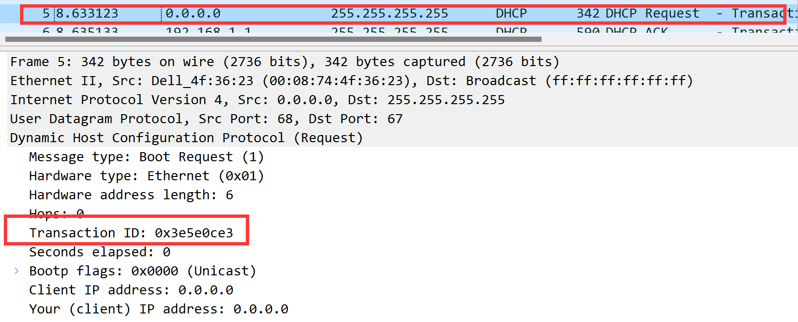

# Wireshark DHCP solution

### Q1

From the above figure, we can find that DHCP messages are sent over **UDP**

### Q2

By having the timing datagram we can find the **source(request) port is 68** and the **destination port(process) is 67**.

### Q3

the link-layer address of the host is **00:08:74:4f:36:23**

### Q4

there are three differences between DHCP discover and request segment 

- **checksum** is different, one is 0xe97b, the other is 0xae85
- **option:(53) DHCP Message Type** is different, one is Request(3) the other is Discover (1)
- **option:(50) Requested IP Address** is existent in the Request segment but not in Discover segment 

### Q5

From the above four screenshots, we will have for each of **the first four (Discover/Offer/Request/ACK**) DHCP messages, the transaction-ID field is **the same (0x3e5e0ce3)**

From the above two figures, we can have the values of the  Transaction-ID in the **second set (Request/ACK**) of DHCP messages is **the same(x257e55a3)** yet.

**The purpose of the Transaction-ID field is an authentication measure**, only when the client request is the same as the server will it be recognized.

### Q6

the four times IP address are as the above figure.

### Q7

the IP address of the DHCP server is **192.168.1.1**

