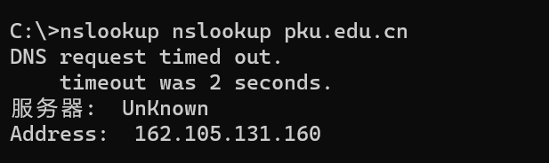
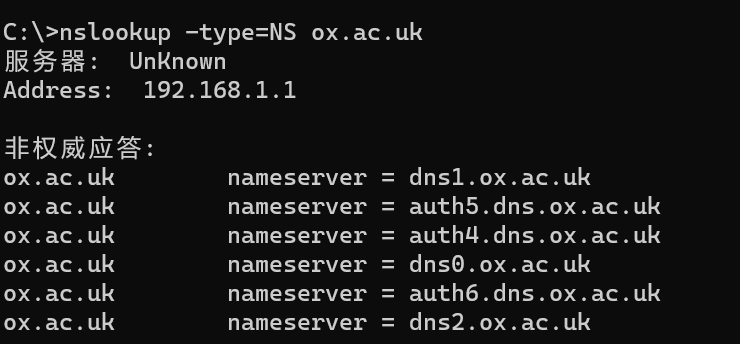
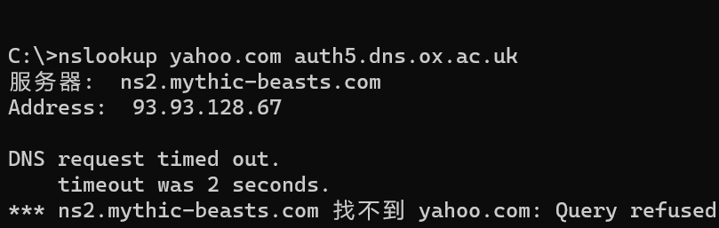
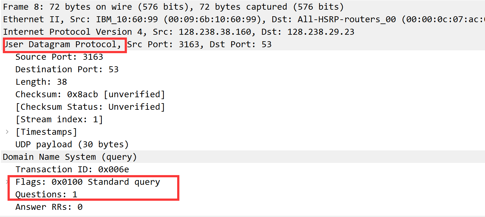

# Wireshark DNS solution

### Q1

By type the command `nslookup pku.edu.cn`, we can have the corresponding IP address is `162.105.131.160`

### Q2

By type into the command`nslookup -type=NS ox.ac.uk`, we can find it coresponding authoritative DNS servers for the oxford in UK is `dns1.ox.ac.uk`

### Q3

By typing the command `nslookup yahoo.com auth5.dns.ox.ac.uk`, its reply is `Query refused`, I think one explaination is the yahoo and oxford DNS server has not in the same domains, and oxford DNS server does not have the cache about the mail of yahoo.com

### Q4

Apparently, the query and response messages are sent by using the **UDP(User Datagram Protocol)**

#### Q5

from the above 

