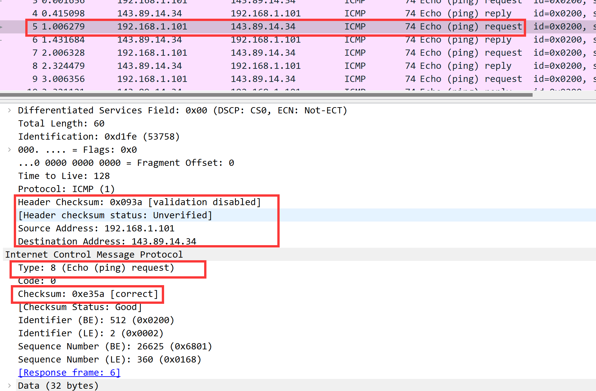
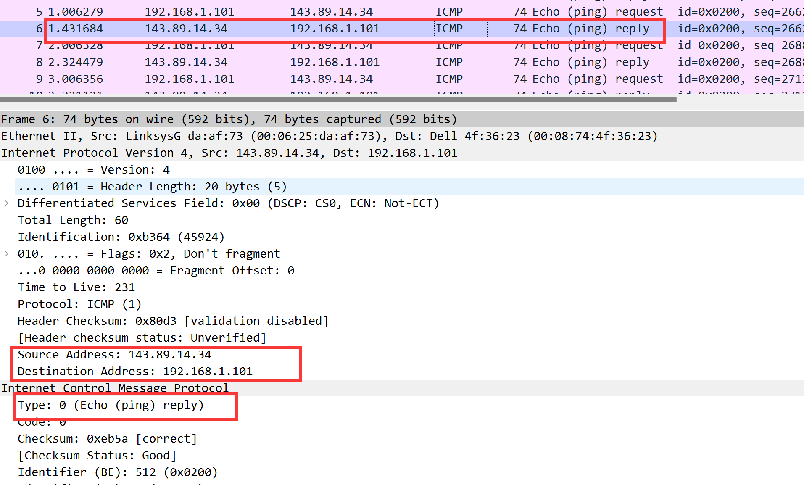

# Wireshark ICMP solution 

### Q1

From the figure, we can find the **IP address of the host** is **192.168.1.101** and the **destination IP address** is **143.89.14.34**

### Q2

Since it is different from TCP or UDP,  it operates at a lower network layer than them,  and is focused on network diagnostics and error reporting, it only needs the IP layer which does not care the port number.

### Q3

from the plot, we can find 

- **the ICMP type is 8(ping request)**
- **code is 0**

and ICMP also contains the **sequence Number, checksum, identifier** and its corresponding bytes are **all 4 bytes.** 

### Q4

From the figure, we can have:

- **ICMP type: 0(ping reply)**
- **code: 0**

and it also has the **sequence number, checksum, identifier**,  all of which are **4 bytes** individually.

### Q5

