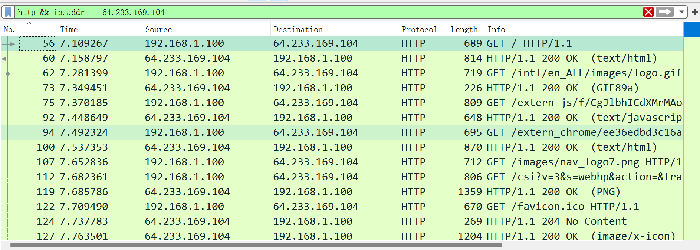
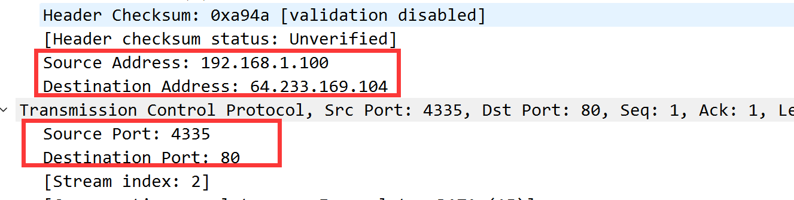
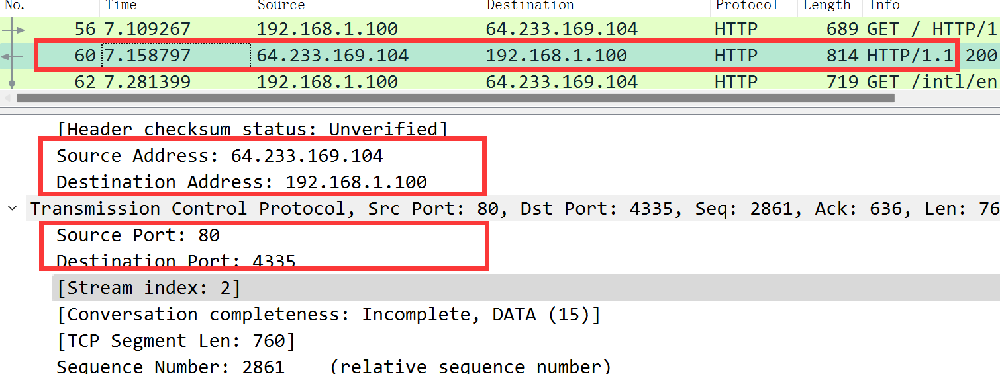
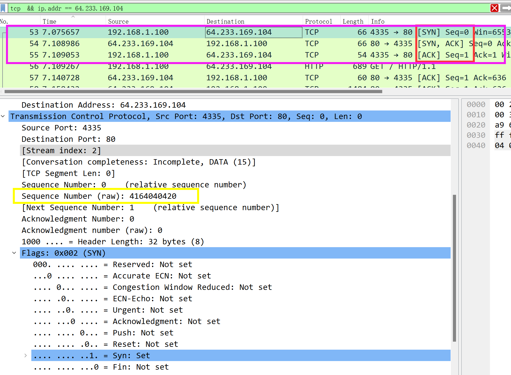
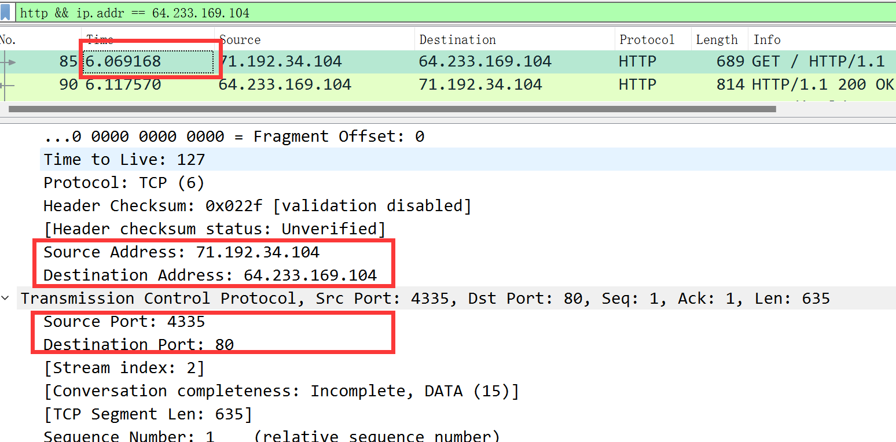
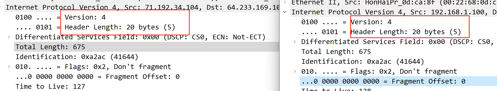
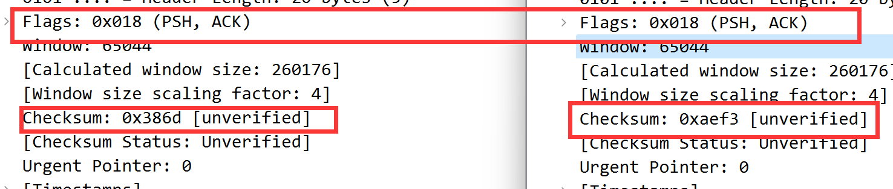
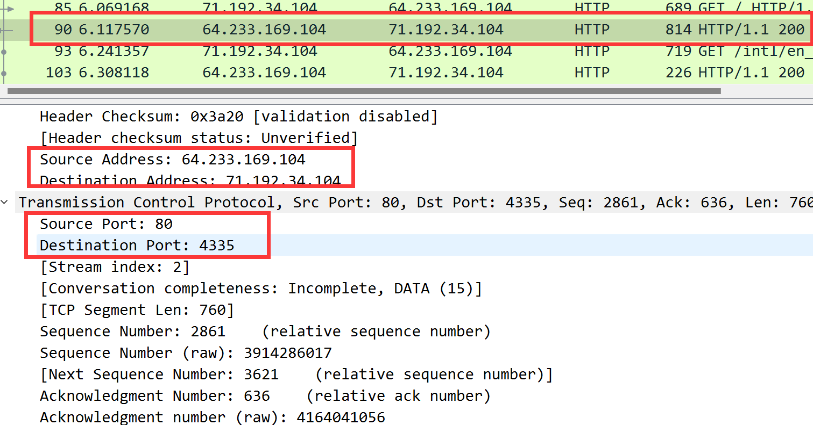
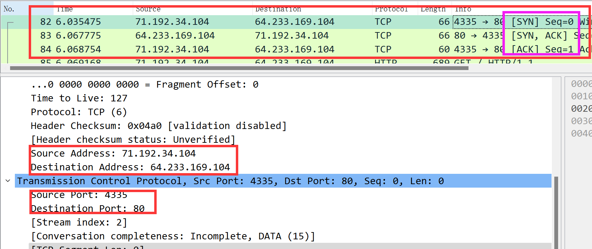

# Wireshark NAT  solution

### Q1

the IP address of the client is **192.168.1.100**

### Q2

After typing into the information of the filter `http && ip.addr == 64.233.169.104` we can have the following figure:

### Q3

we can have the following the figure by checking out the details of the specific TCP segment(at time 7109267):

and we will have the conclusions:

- **Source IP address: 192.168.1.100**
- **Source ports: 4335**
- **Destination IP address: 64.233.169.104**
- **Destination ports: 80**

### Q4

By checking the TCP segments, we can find the corresponding 200 OK HTTP message is received at the **time 7.158797**, some other information are as follows:

- **Source IP address: 64.233.169.104**
- **Source ports: 80**
- **Destination IP address: 192.168.1.100**
- **Destination ports: 4335**

### Q5

From the above figure,we can have the following conclusions:

- SYN 
  - **time: 7.075657s**
  - **Source IP Address: 192.168.1.100 port: 4335**
  - **Destination IP Address: 64.233.169.104 port: 80**
- SYN ACK 
  - **time: 7.108986s**
  - **Source  IP Address: 64.233.169.104 port: 80**
  - **Destination IP Address: 192.168.1.100 port: 4335**

### Q6

From the above figure, we can have the following conclussions:

- **time: 6.069168s**
- **Source IP Address: 71.192.34.104 port: 4335**
- **Destination IP Address: 64.233.169.104 port: 80**

the only different parts of these fields are the **source ip address**

### Q7

From the above figures, we can find that only the **checksum** has been changed, since the IP address has changed, which leads to the change of the total checksum.

### Q8

we can have the following conclusions:

- **time: 6.117570s**
- **Source IP Address: 64.233.169.104 port: 80**
- **Destination IP Address: 71.192.34.104 port: 4335**

### Q9

- SYN 
  - **time: 6.035475s**
  - **Source IP Address: 71.192.34.104 port: 4335**
  - **Destination IP Address: 64.233.169.104 port: 80**
- SYN ACK 
  - **time: 6.067775s**
  - **Source  IP Address: 64.233.169.104 port: 80**
  - **Destination IP Address:  71.192.34.104 port: 4335**

### Q10

**NAT Table**

| WAN side IP and port | LAN side IP and port |
| -------------------- | -------------------- |
| 71.192.34.104:4335   | 192.168.1.100:4335   |

