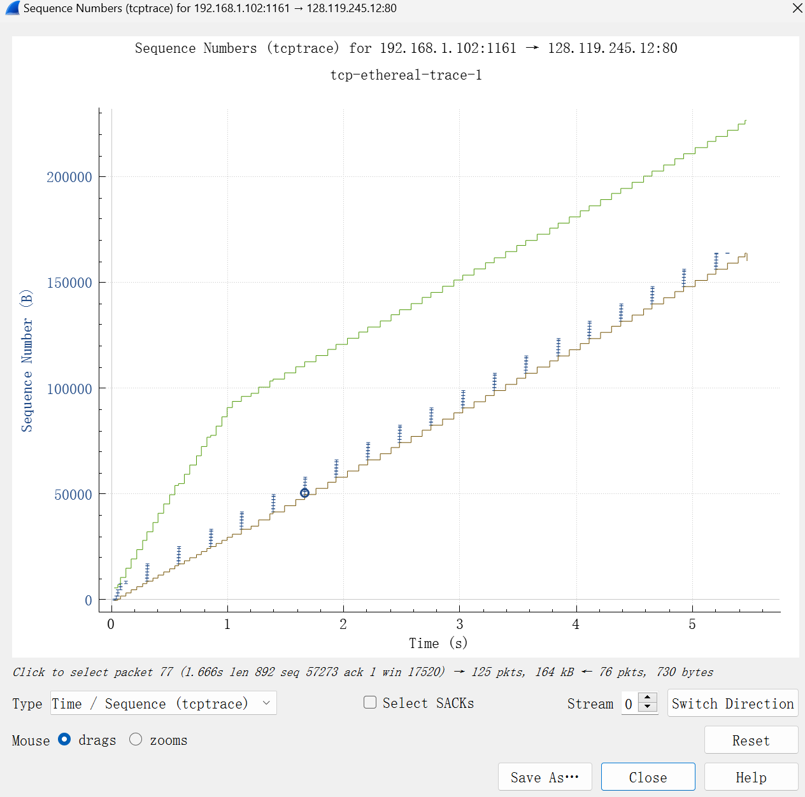

# Wireshark TCP solution

## A first look at the captured trace 

### Q1

From the following image, which contains the detail of the selected TCP packet:

we can find that the IP address and TCP port number used by the client computer are:

- **Source IP address: 192.168.1.102** 
- **Source port number: 1161**

### Q2

From the above figure, we can have the following conclusion:

- the **IP address** of gaia.cs.umass.edu is **128.119.245.12**
- the **port number** to recieve the TCP segments is **80**

### Q3

In my own trace we can have the following figure:

so we will have:

- the **IP address** used by your client computer is **192.168.31.125**
- the source **port number** is **2052**

## TCP Basics

### Q4

From the above figure, we have 

- **the sequence number** of the TCP SYN segment is **232129012**
- From the **Flags(0x002)**, we can find the segment is the initial segment

### Q5

From the above figure, we can have

- the **sequnce number** f the SYNACK segment sent by gaia.cs.umass.edu  to the client computer in reply to the SYN is **883061785**
- the value of **Acknowledgement field** in the SYNACK segment is **232129013**
- gaia.cs.umass.edu can determine the value by using $ACK(SYNACK) = Seq(SYN) + 1$
- From the **Flags(0x012)**, we can find the segment is a SYNACK segment

### Q6

From the above figure, we can find the TCP segment with POST, and its corresponding sequence number is **232293053/164091(relative)**

### Q7

From the above figure, we can calculate the RRT is **190ms**

### Q8

By looking the same above figure, the **length** of the first TCP segment is **565**

### Q9

From the above figure, focus on the **Win** flag, we can find the minimum amount of available buffer space is **17520**,  and it truly slows down the sending rate.

#### Q10

From the above figure, we can show the sequence number of each TCP segment sended with the time flows, we can find that in the green line, all the sequence number is going on without decreasing, which means there exists no retransmission during the TCP segment tranmistting.