# Four-网络层数据平面

## 4.1 网络层概述

**网络层服务**

- 在发送主机和接收主机对之间传送**段（segment）** 
- 在发送端将段封装到数据报中
- 在接收端，将段上交给传输层实体 
- 网络层协议存在于**每一个**主机和路由器
- 路由器检查每一个经过它的**IP**数据报的头部 

### 4.1.1 转发和路由选择：数据平面和控制平面

**功能**

- 转发
  - 将分组从路由器的输入接口转发到合适的输出接口 
- 路由
  - 使用路由算法来 决定分组从发送主机到目标接收主机的路径 
    - 路由选择算法 
    - 路由选择协议 

#### 数据平面

- 本地，每个路由器功能 
- 决定从路由器输入端口 到达的分组如何转发到输出端口 
- 转发功能： 
  - 传统方式：基于目标地址+转发表 
  - **SDN**方式：基于多个字段和**流表**

#### 控制平面

- 网络范围内的逻辑 
- 决定数据报如何在路由器之间路由，决定数据报从源到目标主机之间的端到端路径 
- 2个控制平面方法 
  - 传统的路由算法: 在路由器中被实现 
  - **software-defined networking  (SDN)**: 在远程的服务器中实现 

### 4.1.2 网络服务模型

这些服务可能包括：

- 可靠传送
- 延迟上界保证
- 有序分组交付
- 确保最小带宽
- 安全性

显然上述$Internet$都做不到，只能提供 **(best-effort service) 尽力而为服务**

常见的服务情况：

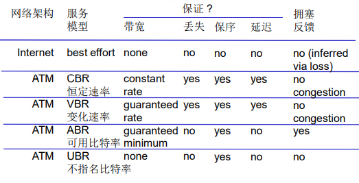

## 4.2 路由器组成

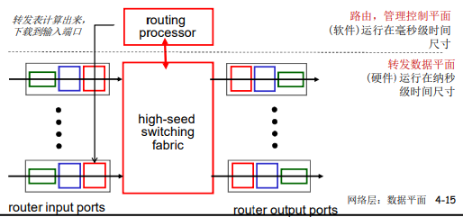

### 4.2.1 输入端口处理和基于目的地转发

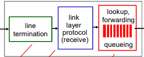

- **line termination**物理层： $Bit$级的接收
- **link layer protocol(recieve)** 数据链路层: 链路层协议动作、解封装
- **lookup、forwarding** 分布式交换：
  - 根据数据报头部的信息如：目的地址 ，在输入端口内存中的转发表中查找合适的输出端口（匹配+行动） 
  - **基于目标的转发：**仅仅依赖于IP数据 报的**目标IP**地址（传统方法） 
  - **通用转发**：基于头部字段的任意集合进行转发 

#### 最长前缀匹配

当给定目标地址查找转发表时，采用**最长**地址前缀匹配的目标地址表项 

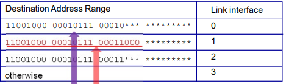

在路由器中经常采用**TCAMs(  ternary content addressable memories)**硬件来完成 

- **内容可寻址**：将地址交给TCAM，它可以在一个时 钟周期内检索出地址，不管表空间有多大 
- **Cisco Catalyst**系列路由器: 在TCAM中可以存储多达约为1百万条路由表项 

#### 输入端口缓存

- 当交换机构的速率小于输入端口的汇聚速率时$\rightarrow$ 在输入端口可能要排队
  - 排队延迟以及由于输入缓存溢出造成丢失! 
-  **Head-of-the-Line (HOL) blocking**: 排在队头的数据报 阻止了队列中其他数据报向前移动 

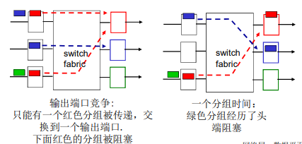

### 4.2.2 交换结构

- 将分组从输入缓冲区传输到合适的输出端口
- 交换速率：分组可以按照该速率从输入传输到输 出 
  - 运行速度经常是输入/输出链路速率的若干倍 
  - $N$ 个输入端口：交换机构的交换速度是输入线路速度的N倍比较理 想，才不会成为瓶颈 
- 三种典型的交换结构

#### 通过内存交换

第一代路由器：

- 在CPU直接控制下的交换，采用传统的计算机 
- 分组被拷贝到系统内存，CPU从分组的头部提取出目标 地址，查找转发表，找到对应的输出端口，拷贝到输出 端口 
- 转发速率被内存的带宽限制 (数据报通过BUS两遍) 
- 一次只能转发一个分组 

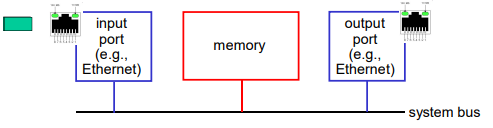

#### 通过总线交换

- 数据报通过共享总线，从输入端 口转发到输出端口 
- **总线竞争**: 交换速度受限于总线带宽 
- 1次处理一个分组 
- 1 Gbps bus, Cisco 1900； 32Gbps bus,Cisco 5600: 对于接 入或企业级路由器，速度足够**（ 但不适合区域或骨干网络）** 

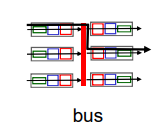

#### 通过互联网络(crossbar等)的交换

- 同时并发转发多个分组，克服总线带宽限制 
- **Banyan（榕树）**网络，**crossbar(纵横**) 和其它的互联网络被开发，将多个处理 器连接成多处理器 
- 当分组从端口A到达，转给端口Y；控 制器短接相应的两个总线 
- 高级设计：将数据报分片为固定长度的 信元，通过交换网络交换 
- **Cisco12000**：以60Gbps的交换速率通 过互联网络 

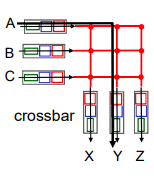

### 4.2.3 输出端口

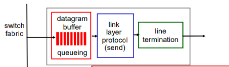

- 当数据报从交换机构的到达速度比传输速率快 就需要输出端口缓存 
- 由调度规则选择排队的数据报进行传输 

#### 输出端口排队

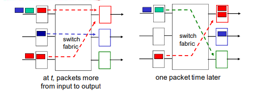

- 假设交换速率$R_{switch}$是$R_{line}$的$N$倍（$N$：输入端口的数量） 
- 当多个输入端口同时向输出端口发送时，缓冲该分组（当通 过交换网络到达的速率超过输出速率则缓存） 
- **排队带来延迟，由于输出端口缓存溢出则丢弃数据报！** 

#### 需要多少缓存

最近的推荐计算公式：
$$
\frac{RTT*C}{\sqrt{N}}
$$
其中$C$是链路中的容量，$N$是端口流

### 4.2.4 分组调度

**调度**：选择下一个要通过链路传输的分组

#### 1. FIFO(first in first out)

丢弃策略

- **tail drop**：丢弃刚到达的分组 
- **priority**: 根据优先权丢失/移除分组 
- **random:** 随机地丢弃/移除 

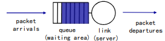

#### 2. 优先权排序

发送最高优先权的分组

- 多类，不同类别又不同的优先权
  - 类别可能依赖于标记或者其 他的头部字段 
  - 先传高优先级的队列中的分 组，除非没有 
  - 高（低）优先权中的分组传 输次序：FIFO 

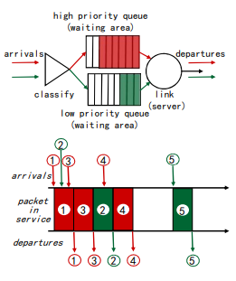

#### 3. 循环和加权公平排序

**Round Robin (RR) scheduling:** 

- 多类
- 循环扫描不同类型的队列, 发送完一类的一个分组 ，再发送下一个类的一个分组，循环所有类 

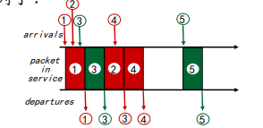

**Weighted Fair Queuing (WFQ):** 

- 一般化的Round Robin 
- 在一段时间内，每个队列得到的服务时间是：$\frac{w_i}{\sum w_i}*t$，和权重成正比 
- 每个类在每一个循环中获得不同权重的服务量 

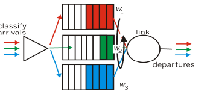

## 4.3 IP: Internet protocol

### 4.3.1 数据报格式

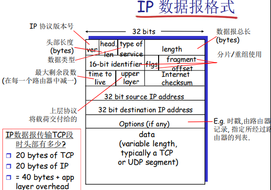

### 4.3.2 IP 分片和重组

- 网络链路有MTU (最大传输单元) –链路层帧所携带的最大数据 
  - 不同的链路类型 
  - 不同的MTU  
- 大的IP数据报在网络上被分片 **(“fragmented”)** 
  - 一个数据报被分割成若干个小 的数据报 
    - 相同的ID 
    - 不同的偏移量 
    - 最后一个分片标记为0 
  - “重组”只在最终的目标主机 进行 
  - IP头部的信息被用于标识，排 序相关分片 

**举例**

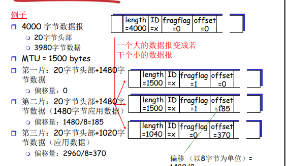

### 4.3.3 IPV4编址

#### 引论

**IP地址**：32位标示，对 主机或者路由器的接口编址 

**组成**

- 子网部分(高位bits) 
- 主机部分(低位bits)  

**接口**：主机/路由器和物 理链路的连接处 

- 路由器通常拥有多个接口 
- 主机也有可能有多个接口 
- **IP**地址和每一个接口关联 

**一个IP地址和一个接口 相关联** 

#### 子网(subnets)

- 一个子网内的节点（主机或者路由器）它们的 IP地址的高位部分相同 ，这些节点构成的网络 的一部分叫做子网 
- **无需路由器介入**，子网内各主机可以在物理上相互直接到达 

##### 判断子网办法

- 要判断一个子网, 将每一 个接口从主机或者路由 器上分开,构成了一个个 网络的孤岛 
- 每一个孤岛（网络）都 是一个都可以被称之为 subnet. 

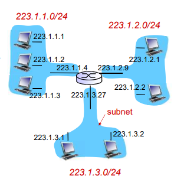

#### IP 地址分类

- Class A: 126 networks , 16 million hosts
- Class B：16382networks ，64 K hosts 
- Class C：2 million networks ，254 host 
- Class D：multicast 
- Class E：reserved for future 

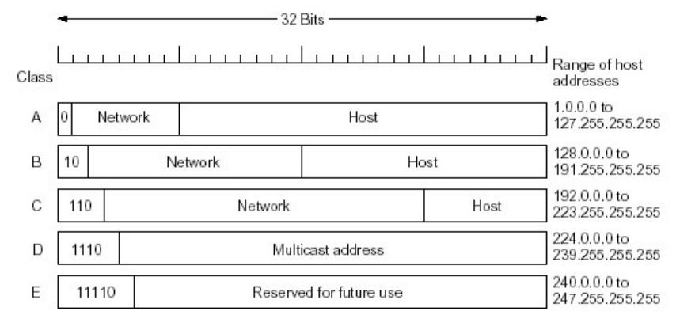

#### 特殊IP地址

##### 一些约定

- 子网部分: 全为 0---本网络 
- 主机部分: 全为0---本主机 
- 主机部分: 全为1--广播地址，这个网络的所有 主机 

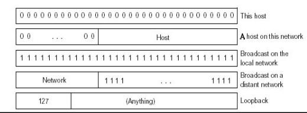

#### 内网（专用）IP 地址

- 专用地址：地址空间的一部份供专用地址使用 
- 永远不会被当做公用地址来分配, 不会与公用地址重 
  - 只在局部网络中有意义，区分不同的设备 
- 路由器不对目标地址是专用地址的分组进行转发 
- 专用地址范围 
  - **Class A** 10.0.0.0-10.255.255.255 MASK 255.0.0.0 
  -  **Class B** 172.16.0.0-172.31.255.255 MASK 255.255.0.0 
  - **Class C** 192.168.0.0-192.168.255.255 MASK  255.255.255.0 

#### IP编址：CIDR

**CIDR：Classless InterDomain Routing** （无类域间路由） 

- 子网部分可以在任意的位置 
- 地址格式: a.b.c.d/x, 其中 x 是地址中子网号的长度

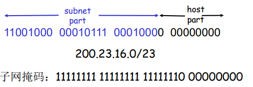

#### 子网掩码

- 32 bits, 0 or 1 in each bit
  - 1: bit位置表示子网部分 
  - 0:bit位置表示主机部分 
- 原始的A、B、C类网络的子网掩码分别是 
  - A：255.0.0.0 ：11111111 00000000 0000000 00000000 
  - B：255.255.0.0：11111111 11111111 0000000 00000000 
  - C：255.255.255.0：11111111 11111111 11111111 00000000 
- CIDR下的子网掩码例子： 
  - 11111111 11111111 11111100  00000000
- 另外的一种表示子网掩码的表达方式 
  - /# 
    - /22：表示前面22个bit为子网部分 

#### 获取IP地址

**DHCP: Dynamic Host Configuration Protocol** 动态主机配置协议

即插即用 **"Plug-and-play"**

目标：允许主机在加入网络的时候，动态地从服务器那里获 得IP地址： 

- 可以更新对主机在用IP地址的租用期-租期快到了 
- 重新启动时，允许重新使用以前用过的IP地址 
- 支持移动用户加入到该网络（短期在网） 

##### DHCP工作概况: 

- 主机广播“**DHCP discover**” 报文【可选】
- DHCP 服务器用 **“DHCP offer”** 提供报文响应 【可选】
- 主机请求IP地址： 发送 "**DHCP request**" 报文
- DHCP服务器发送地址："**DHCP ack**" 报文

##### DHCP 返回

- IP地址
- 默认网关的IP地址
- DNS服务器的域名和IP地址
- 子网掩码（指示地址部分的网络号和主机号）

层次编址：路由聚集 **(route aggregation)**

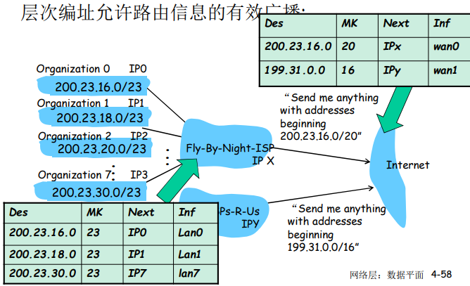

### 4.3.4 网络地址转换（NAT:Network Address Translation）

实现：NAT路由器必须

- 外出数据包：替换源地址和端口号为NAT IP地址 和新的端口号，目标IP和端口不变 远端的C/S将会用NAP IP地址，新端口号作为目标地址 
- 记住每个转换替换对（在NAT转换表中） .. 源IP，端口 vs NAP IP ，新端口 
- 进入数据包：替换目标IP地址和端口号，采用存 储在NAT表中的mapping表项，用（源IP，端口） 

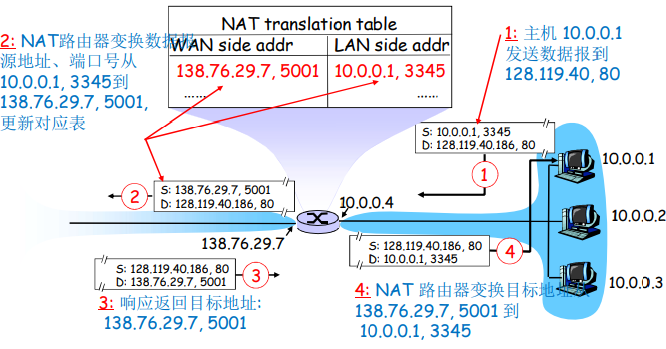

#### NAT 争议

- 路由器只应该对第3层做信息处理，而这里对端口号（4层）作了处 理 
- 违反了end-to-end 原则 
  - 端到端原则：复杂性放到网络边缘 
    - 无需借助中转和变换，就可以直接传送到目标主机 
  - NAT可能要被一些应用设计者考虑, eg, P2P applications 
  - 外网的机器无法主动连接到内网的机器上 
- 地址短缺问题可以被IPv6 解决 
- NAT穿越：如果客户端需要连接在NAT后面的服务器，如何操作 

### 4.3.5 IPV6

**初始动机:** 32-bit地址空间将会被很快用完

另外的动机

- 头部格式改变帮助加速处理和转发 
  - TTL-1 
  - 头部checksum 
  - 分片 
- 头部格式改变帮助QoS  

#### 数据报格式

- 固定的40字节头部
- 数据报传输过程中，不允许分片 

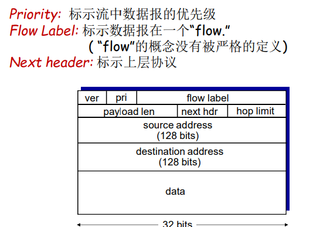

#### 和IPV4的其他变化

- Checksum: 被移除掉，降低在每一段中的处理 速度 
- Options: 允许，但是在头部之外, 被 “Next  Header” 字段标示 
- ICMPv6: ICMP的新版本 
  - 附加了报文类型, e.g. “Packet Too Big”
  - 多播组管理功能 

#### 从IPV4到IPV6的平移

- 不是所有的路由器都能够同时升级的 
  - 没有一个标记日 “flag days” 
- **隧道**: 在IPv4路由器之间传输的IPv4数据报中携 带IPv6数据报 

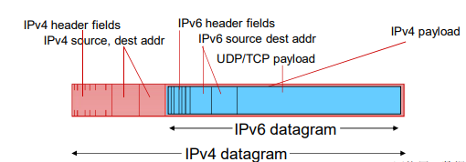

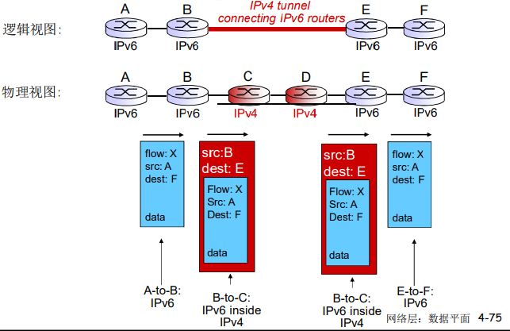

## 4.4 通用转发和SDN 

**SDN**相关请见**Compt 1** 