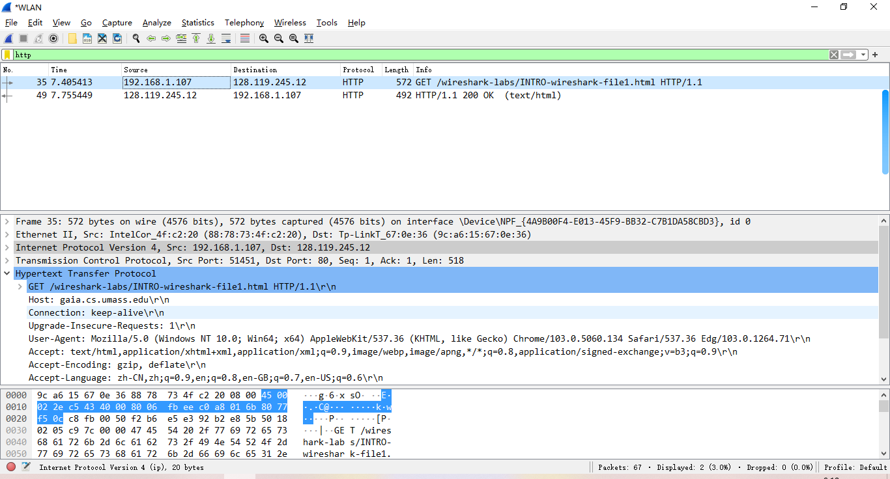
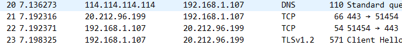
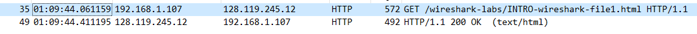
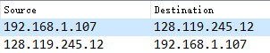

#### Q1

#### Q2

Finish the setting and we can easily calculate the answer

Time = 44.4111-44.0611 =  **0.35 seconds**

#### Q3

So we can find that the Internet address of  the gaia.cs.umass.edu is **128.119.245.12** and  my host's Internet address is **192.168.1.107**

#### Q4

Why not have a look at `./files/HTTP.pdf`

