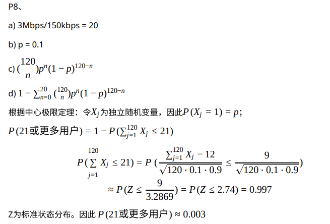

## 复习题

#### R1

```txt
端系统就是主机，主机就是端系统；
端系统常见的有：clinet客户端，app客户端，google数据中心等
web服务器是端系统
```

#### R2

```txt
外交是指一个国家、城市或组织等在国际关系上的活动，其目的在于建立能够满足彼此需求的关系[1]。如互派使节、进行谈判、会谈。一般来说，外交是国家之间通过外交官就和平、文化、经济、贸易或战争等问题进行协商的过程。一般而言，国际条约首先是由外交官协商而成，再由国家的政治家(如总统、领袖、元首)批准签署后才生效的。国家、国际间的外交为邦交或国交，城市、城际间的外交为友好城市。
```

#### R3

```txt
标准对于协议来说，可以让⼈们创建可以相互操作的⽹络系统和产品
```

#### R4

```txt
a)通过电话线的拨号调制解调器：家庭
b)通过电话线的DSL（Digital Subscriber Line，数字⽤⼾线）：家庭或⼩办公室
c)混合光纤同轴电缆（HFC）：家庭
d)100M交换以太⽹：企业
e)⽆线⽹（Wifi 802.11）：家庭或企业
f)3G和4G：⼴域⽆线⽹
```

#### R5

```txt
HFC带宽是由⽤⼾共享。下⾏通道中，所有的包都是由头端这⼀个单⼀源发出的。因此，下⾏通道中没有碰撞。
```

#### R6

```txt
拨号、DSL、调制解调器、光纤到⼾
```

#### R7

```txt
10Mbps、100Mbps、1Gbps、10Gbps
```

#### R8

```txt
大部分情况是双绞铜线，小部分是光纤
```

#### R9

```txt
拨号调制解调器：最⾼50Kbps，带宽专⽤
DSL：下⾏最⾼24Mbps，上⾏最⾼2.5Mbps，带宽专⽤
HFC：下⾏最⾼30Mbps，上⾏最⾼2Mbps，带宽共享
FTTH：上⾏2-10M，下⾏10-20M，带宽不共享
```

#### R10

```
(1)WiFi。⽤于⽆线局域⽹，⽆线⽤⼾从辐射范围为⼏⼗⽶的基站（例如⽆线接⼊点） 传输/接收数据包。基站连接⽆线⽹络，并为⽆线⽤⼾提供⽆线⽹服务。
(2)3G和4G⼤范围⽆线⽹。此系统通过电信服务商提供的基站，由蜂窝电话通过同⼀个⽆线设备传输数据。可以提供基站⼏⼗千⽶范围内的⽆线⽹络。
```

#### R11

```txt
端到端总延时是L/R1+L/R2
```

#### R12

```
电话交换网络可以在一段时间保证一定量的端到端宽带。
FDM需要复杂的模拟硬件来将信号转换称为合适的频率
```

#### R13

```txt
a) 两个用户
b) 既然每个⽤⼾传输时要求1Mpbs带宽，如果两个或者更少的⽤⼾同时传输，最多要求2Mbps。既然共享链路的可⽤带宽是2Mbps，那么传输前没有排队延时。如果有3个⽤⼾同时传输，带宽要求是3Mbps，其超过了共享链接可⽤带宽。这种情况下，连接之前会有排队延时.
c) 0.2
d) 0.008
```

#### R14

```
	如果两个ISP不对等，那么当他们给对⽅发送流量时他们需要通过⼀个付费流量ISP提供商（中间商）来发送数据。通过直接对等传输，两个ISP可以减少给其他ISP提供商的费⽤。
	多个ISP可以通过⽹络交换点（IXP）（通常由它⾃⼰的交换机单独构建）作为汇合点来直接对等传输。ISP通过对连接⾄IXP的每⼀个ISP收取少量费⽤来盈利，当然利润取决于IXP发送或接收的流量数.
```

#### R16

```
处理延迟、传播延迟、传输延迟、排队延迟
通常排队延迟是变化的，其余都是不变的
```

#### R18

```
10 ms
d/s 无关
```

#### R19

```
a) 500kbps
b) 64s
c) 100kbps 320s
```

#### R20

```
终端系统A将⼤⽂件拆分为块。A通过添加⽂件头信息⾄每⼀个块来从⽂件⽣成多个数据包。数据包的头信息包含⽬标（终端系统B）IP地址。数据包交换机通过包中的⽬标IP地址来决定发送链接。考虑到包⽬标地址，包选择哪条路⾛和包选择哪条外链⾛的⽅法相似。
```

#### R23

```
自顶向下依次是：应用层、传输层、网络层、链路层、物理层
```

#### R24

```
应用层报文：应用程序想要发送和通过传输层的数据
传输层段：由传输层⽣成并且封装有传输层头信息的应⽤层报⽂
⽹络层数据段：封装有⽹络层头信息的传输层段
链路层帧：封装有链路层头信息的⽹络层数据段
```

#### R25

```
处理物理层、链路层、网络层
链路交换机处理物理层和链路层
主机处理所有五个层次
```

## 习题

#### P2

```txt
可以推导得到
T = (N+P-1)*(L/R)
```

#### P3

```txt
a) 电路交换网络更适合这个应用，因为传输频率是已知的，并且具有可预测的平滑带宽需求。
b) 不需要，传输速率综合小于链路容量
```

#### P4

```txt
a) 最大数量是16条
b) 8条
c) 完全可以
```

#### P6

```txt
a) d_prop = m / s
b) d_trans = L / R
c) d_endtoend = m / s + L / R 
d) 此位刚刚离开主机
e) 第一位还在链路上还没有到达主机
f) 第一位已经到达主机B了
g)  


```

#### P7

```txt
t_sum = 7ms + 10ms + 0.224ms = 17.224ms 
```

#### P8



#### P10

```txt
D = 6 + 6 + 6 + 20 + 16 + 4 + 3 + 3 = 64ms
```

#### P11

```txt
d_end−end = L/R + d1/s1 + d2/s2 + d3/s3
```

#### P12

```txt
到达的数据包必须⾸先等待链路发送4.5×1500字节=6750字节或54000⽐特。由于这些⽐特是以2Mbps发送的，所以队列延迟为27毫秒。⼀般情况下，排队延迟为1500 × 8b ÷ 2Mb/s = 12000 * 10^-6s = 6ms
4.5个分组的总排队延时为4.5 * 6ms = 27ms
```

#### P13

```txt
a) (N − 1)L/(2R)
b) (N − 1)L/2R
```

#### P14

```txt
a) L/(R(1-I))
b) 不妨令x = L/R 则 总延迟为 x/(1-ax) 以此做出图像即可
```

#### P15

```txt
1/（μ-a）
```

#### P16

```txt
N = 10 + 1 = 11 个分组
N = a * d  ==> (10+1) = a*(0.01+1/100) ==> a = 550 包/s
```

#### P20

```txt
min{Rs, Rc, R/M}
```

#### P22

```txt
成功被接收方收到的概率是 ps = (1-p)^N
平均下来，需要重传 （1/ps） - 1  次
```

#### P25

```txt
a) t_prop = 0.08s R*t_prop = 1.6*10^5 bits
b) 1.6*10^5 bits
c) 链路中可以存在的最⼤位数
d) 1位是2*10^6m / 1.6*10^5 bits = 125m ⻓,比足球场大
e) S/R
```

#### P26

```txt
R = s/m
```

#### P27

```txt
a)  8 ∗ 10 b
b) 8*10^5 bits
c) s/R = 0.25m
```

#### P29

```txt
a) d_prop = 3.6*10^7m/(2.4*10^8) = 0.15s
b) R * d_prop = 1.5*10^6 bits
c) 60s * 10Mbps = 6*10^8 bits
```

#### P31

```txt
a) 8*10^6 bit / 2*10^6 bps = 4s
总的时间为： T = 4*3 = 12s
b) t = 10 ms 
c) T = (800+3-1) * 5ms = 4.01s 时延明显减少
```

#### P33

```txt
S最小值为 sqrt(40*F)
```

#### P34

```
电路交换电话⽹络和因特⽹在“⽹关”连接在⼀起。当Skype⽤⼾(连接到Internet)呼叫普通电话时，通过电路交换⽹在⽹关和电话⽤⼾之间建⽴链路。Skype⽤⼾的语⾳通过互联⽹以数据包的形式发送到⽹关。在⽹关处，对语⾳信号进⾏重构，然后通过电路发送。另⼀⽅⾯，语⾳信号通过电路交换⽹络发送到⽹关。⽹关对语⾳信号进⾏分组，并将语⾳分组发送给Skype⽤⼾。
```

