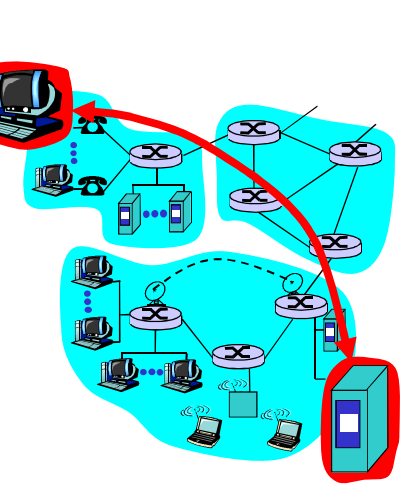

# 第一章计算机网络和因特网

## 1.1 什么是互联网

### 1.1.1 具体构成描述

- **端系统(end system) == 主机(host)**
- 端系统通过**通信链路**和**分组交换机**连接在一起
  - **通信链路**是由不同类型的物理媒体组成，其中包括同轴电缆、铜线、光纤、无线电频谱。通信的**传输速率**以比特/秒（bit/s，或bps）度量，称为**带宽**。
  - **分组交换机**从它的一条入通信链路接收到达的分组，并从它的一条出通信链路转发该分组。其中最为著名的两种是**路由器（router）**和**链路层交换机(link-layer switch)**，其中链路层交换机通常用于接入网中，二路由器通常用于网络核心中。
- 从发送端系统到接收端系统， 一个分组所经历的一系列通信链路和分组交换机称为通过该网络的**路径** (route 或 path)
- 端系统通过**因特网服务提供商** （Internet Service Provider, **ISP**） 接入因特网，每个 ISP 自身就是一个由多台分组交换机和多段通信链路组成的网络，可以认为是低层次网络，而较低层的 ISP 通过国家的、国际的较高层互联起来，较高层 SP 是由通过高速光纤链路互联的高速路 由器组成的。
- 端系统、分组交换机和其他因特网部件都要运行一系列**协议 (protocol)** , 这些协议控制因特网中信息的接收和发送。

### 1.1.2 服务描述

- 因特网应用还包括移动智能手机和平板电脑应用程序涉及多个相互交换数据的端系统，故它们被称为**分布式应用程序 (distributed application)** 
- 与因特网相连的端系统提供了一个**套接字接口 (socket interface)** , 该接口规定了运行 在一个端系统上的程序请求因特网基础设施向运行在另一个端系统上的特定目的地程序交付数据的方式  

### 1.1.3 什么是协议

- **协议 (protocol)** 定义了在两个或多个通信实体之间交换的报文的格式和顺 序，以及报文发送和/或接收一条报文或其他事件所采取的动作 

## 1.2 网络边缘

**端系统** 容纳（即运行）应用程序

上图中主机（即端系统）就是位于网络边缘的，并且主机可进一步划分为两类：**客户(client)和服务器(server)**

### 1.2.1 接入网

- **接入网**，这是指将 端系统物理连接到其边缘路由器 (edge router) 的网络；**边缘路由器**是端系统到任何其他 远程端系统的路径上的第一台路由器 
- 服务模式包括两种：
  - 客户/服务器模式(cs模式):
    - 客户端向服务器请求、接受服务
    - 如Web浏览器/服务器；email 客户端/服务器 
  - 对等( peer-peer )模式:
    - 很少（甚至没有）专门的服务器 
    - 如 Gnutella、KaZaA、Emule 
- 

## 小结

- **Internet**是由结点和边组成的

  **结点**

  - 主机及其上运行的应用程序
  - 路由器、交换机等网络交换设备

  **边**

  - 接入网链路、主机链接到互联网的链路
  - 主干链路：路由器间的链路

