# 第一章计算机网络和因特网

## 1.1 什么是互联网

### 1.1.1 具体构成描述

- **端系统(end system) == 主机(host)**
- 端系统通过**通信链路**和**分组交换机**连接在一起
  - **通信链路**是由不同类型的物理媒体组成，其中包括同轴电缆、铜线、光纤、无线电频谱。通信的**传输速率**以比特/秒（bit/s，或bps）度量，称为**带宽**。
  - **分组交换机**从它的一条入通信链路接收到达的分组，并从它的一条出通信链路转发该分组。其中最为著名的两种是**路由器（router）**和**链路层交换机(link-layer switch)**，其中链路层交换机通常用于接入网中，二路由器通常用于网络核心中。
- 从发送端系统到接收端系统， 一个分组所经历的一系列通信链路和分组交换机称为通过该网络的**路径** (route 或 path)
- 端系统通过**因特网服务提供商** （Internet Service Provider, **ISP**） 接入因特网，每个 ISP 自身就是一个由多台分组交换机和多段通信链路组成的网络，可以认为是低层次网络，而较低层的 ISP 通过国家的、国际的较高层互联起来，较高层 SP 是由通过高速光纤链路互联的高速路 由器组成的。
- 端系统、分组交换机和其他因特网部件都要运行一系列**协议 (protocol)** , 这些协议控制因特网中信息的接收和发送。

### 1.1.2 服务描述

- 因特网应用还包括移动智能手机和平板电脑应用程序涉及多个相互交换数据的端系统，故它们被称为**分布式应用程序 (distributed application)** 
- 与因特网相连的端系统提供了一个**套接字接口 (socket interface)** , 该接口规定了运行 在一个端系统上的程序请求因特网基础设施向运行在另一个端系统上的特定目的地程序交付数据的方式  

### 1.1.3 什么是协议

- **协议 (protocol)** 定义了在两个或多个通信实体之间交换的报文的格式和顺 序，以及报文发送和/或接收一条报文或其他事件所采取的动作 

## 1.2 网络边缘

**端系统** 容纳（即运行）应用程序

上图中主机（即端系统）就是位于网络边缘的，并且主机可进一步划分为两类：**客户(client)和服务器(server)**

### 1.2.1 接入网

- **接入网**，这是指将 端系统物理连接到其边缘路由器 (edge router) 的网络；**边缘路由器**是端系统到任何其他 远程端系统的路径上的第一台路由器 
- 服务模式包括两种：
  - 客户/服务器模式(cs模式):
    - 客户端向服务器请求、接受服务
    - 如Web浏览器/服务器；email 客户端/服务器 
  - 对等( peer-peer )模式:
    - 很少（甚至没有）专门的服务器 
    - 如 Gnutella、KaZaA、Emule 

### 1.2.2 物理媒体

物理媒体分成两类：**导引型媒体**（guided media）和**非导引型媒体**（unguided media）

- 双绞铜线

  最便宜并且最常用的导引型传输媒体是**双绞铜线**。双绞线由两根绝缘的铜线组成，每根大约 1mm 粗，以规则的螺旋状排列着 这两根线被绞合起来，以减少邻近类似的双绞线的电气干扰。无屏蔽双绞线 (Unshielded Twisted Pair, UTP)常用在建筑物内的计算机网络中，即用于局域网（LAN） 中。

- 同轴电缆

  与双绞线类似，同轴电缆由两个铜导体组成，但是这两个导体 同心的而不是并行的。

- 光纤

  光纤是一种细而柔软的 能够导引光脉冲的媒体 ，每个脉冲表示 个比特 根光 纤能够支持极高的比特速率，高达数十甚至数百 Gbp 它们不受电磁干扰，长达 100km 的光缆信号衰减极低，并且很难窃听 。

- 陆地无线电信道

  无线电信道承载电磁频谱中的信号 它不需要安装物理线路，并具有穿透墙壁、提供与移动用户的连接以及长距离承载信号的能力，因而成为 种有吸引力的媒体。

- 卫星无线电信道

  一颗通信卫星连接地球上的两个或多个微波发射器/接收器，它们被称为地面站。该卫星在一个频段上接收传输，使用一个转发器（下面讨论）再生信号，并在另一个频率上发射信号。通信中常使用两类卫星：**同步卫星 (geostationary satellite) 近地轨道 (Low-Earth Orbiting, LEO) 卫星** 

### 1.2网络边缘补充

- 采用网络设施的面向连接服务

  目标：在端系统之间传输数据

  - 握手：在数据传输之前做好准备

    - 人类协议中：你好、你好
    - 两个通信主机之间为**连接建立状态**

  - TCP - 传输控制协议

    - **Internet** 上面向连接的服务

    TCP 服务

    - 可靠的、按顺序的传送数据  （确认和重传）
    - 流量控制 （发送方不会淹没接收方）
    - 拥塞控制（当网络拥塞时，发送方降低发送速率）

- 采用基础设施的无连接服务

  目标：在端系统间传输数据（无连接服务）

  - UDP - 用户数据报协议(user datagram protocol)
    - 无连接
    - 不可靠数据传输
    - 无流量控制
    - 无拥塞控制

## 1.3 网络核心

网络核心， 即由互联因特网端系统的分组交换机和链路构成的网状网络 。

### 1.3.1 分组交换

- 为了从源端系统向目的端系统发送一个报文，源将长报文划分为较小的数据块，称之为 **分组 (packet)** 。在源和目的地之间，每个分组都通过通信链路和**分组交换机 (packet switch)**  传送 。
- 交换机主要有两类 ：**路由器 router)** 、**链路层交换机(link-layer switch)**

1. 存储转发传输

   存储转发传输是指在交换机能够开始向输出链路传输该分组的第一个比特之前 ，必须接收到整个分组。

   

2. 排队时延和分组丢失

   每台分组交换机有多条链路与之相连。对于每条相连的链路，该分组交换机具有一个**输出缓存 (output buffer, 也称为输出队列 (output queue))** , 它用于存储路由器准备发往那条链路的分组。该输出缓存在分组交换中起着重要的作用：如果到达的分组需要传输到某条链路， 但发现该链路正忙于传输其他分组，该到达分组必须在输出缓存中等待。因此，除了存储转发时延以外，分组还要承受输出缓存的**排队时延 (queuing delay)**  

3. 转发表和路由选择协议 

   在因特网中，每个端系统具有一个称为 IP 地址的地址。当源主机要向目的端系统发送一个分组时，源在该分组的首部包含了目的地的 IP 地址。如同邮政地址那样，该地址具有一种等级结构。当一个分组到达网络中的路由器 路由器检查该分组的目的地址一部分，并向一台相邻路由器转发该分组。更特别的是，每台路巾器具有 **转发表 ( forwarding table)** , 用于将目的地址 （或目的 地址的一部分）映射成为输出链路 当某分 组到达一台路由器时，路由器检查该地址，并用这个目的地址搜索其转发表，以发现适当的出链路。路由器则将分组导向该出链路 

### 1.3.2 电路交换

在电路交换网络中，在端系统间通信会话期间，预留了端系统间沿路径通信所需要的资源（缓存，链路传输速率）。  会话的报文 按需使用这些资源，其后果可能是不得不等待（即排队）接入通信线路 。

特点：为呼叫预留端-端资源

链路中的电路是通过**频分复用 (Frequency- Division Multiplexing, FDM)** 或**时分复用 (Time-Di vision Multiplexing, TDM)** 实现的

**在计算中注意是怎么分成出来时间间隙的，以及是不是TDM实现的** 

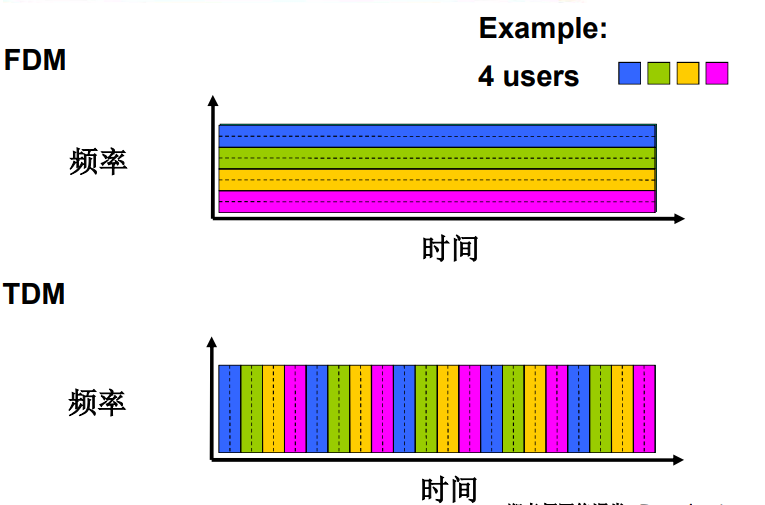

- 电路交换的缺点：
  - 连接建立时间长
  - 计算机之间的通信具有突发性，使用线路交换，浪费的片段有点多，并且即使这个呼叫没有数据传递，其所占据的片也不能够被别的呼叫使用。
  - 可靠性不高

### 1.3.3 网络的网络

- 端系统通过接入ISPs (Internet Service Providers)连接到互联网 例如：住宅、公司和大学的ISPs
- 接入ISPs相应的必须是互联的，从而任何两个端系统可以互相发送给分组到对方

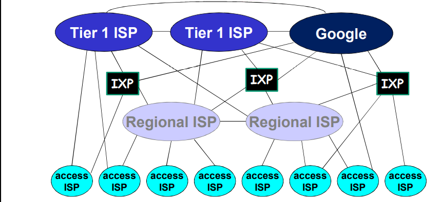

Internet结构：松散的层次模型

- 中心：第一层ISP
  - 直接与其他第一层ISP相连
  - 与大量的第二层ISP和其他客户网络相连

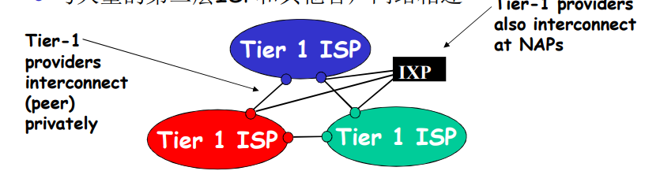

- 第二层ISP：更小些的（通常是区域性的）ISP
  - 与一个或多个第一层ISPs，也可能与其他第二层ISP

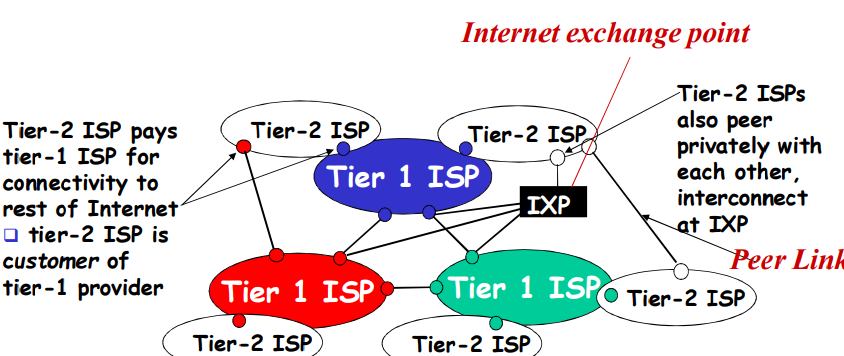

- 第三层ISP与其他本地ISP  
  - 接入网 (与端系统最近) 

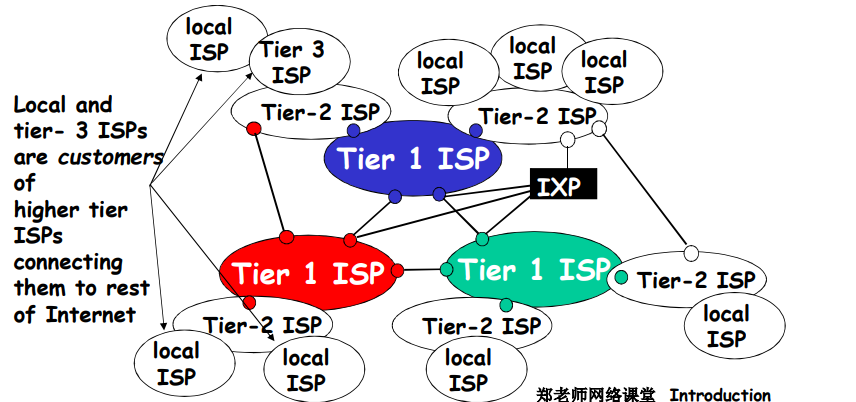

而ISP之间的连接的手段有:

- **POP**: 高层ISP面向客户网络的接入点，涉及费用结算,如一个低层ISP接入多个高层ISP，**多宿（multi home）** 
- 对等接入：2个ISP对等互接，不涉及费用结算 
- **IXP**：多个对等ISP互联互通之处，通常不涉及费用结算  对等接入 
- **ICP**自己部署专用网络，同时和各级**ISP**连接 

## 1.4 分组交换网中的时延、丢包和吞吐量

### 1.4.1 分组交换网中的时延概述

分组从一台主机（源）出发，通过一系列路由器传输，在另一台主机（目的地）中结束它的历程。当分组从 个节点（主机或路由器）沿着这条路径到后继节 点（主机或路由器），该分组在沿途的每个节点经受了几种不同类型的时延 这些时延最 为重要的是**节点处理时延 (nodal processing delay)** 、**排队时延 (queuing delay）** 传**输时延 ( transmission delay)** 和**传播时延 (propagation delay)** , 这些时延总体累加起来是**节点总时 （total nodal delay )**  

下面具体介绍时延类型：

- 节点处理延时
  - 检查 bit级差错 
  - 检查分组首部和决定将分 组导向何处 
- 排队延时
  - 在输出链路上等待传输的 时间 
  - 依赖于路由器的拥塞程度
- 传输延时
  - **R**=链路带宽(bps) 
  - **L**=分组长度(bits) 
  - 将分组发送到链路上的 **时间= L/R** 
  - 存储转发延时 
- 传播延时
  - **d** = 物理链路的长度 
  - **s** = 在媒体上的传播速度 (~2x108 m/sec) 
  - 传播延时 **= d/s** 

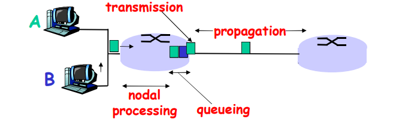

节点延时计算公式：

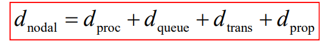

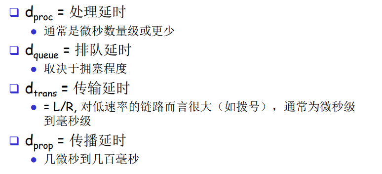

### 1.4.2 排队延时和丢包

**流量强度I (intensity) = La/R**  用于估计排队时延的范围方面

- R=链路带宽 (bps)
- L=分组长度 (bits) 
- a=分组到达队列的平均速率 

下面讨论流量强度的影响：

- La/R ~ 0: 平均排队延时很小 
- La/R -> 1: 延时变得很大 
- La/R > 1: 比特到达队列的速率超过了从该队 列输出的速率，平均排队延时将趋向无穷大！ 

综上所述，设计系统时，流量强度不能大于1！

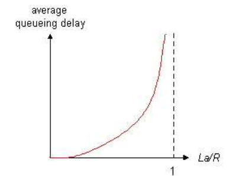

​	在现实中，一条链路前的队列只有有限的容量，尽管排队容量极大地依赖于路由器设计和成本，因为该排队容量是有限的，随着流量强度接近 1，排队时延并不真正趋向无穷大。相反，到达的分组将发现 一个满的队列，由于没有地方存储这个分组，路由器将**丢弃 (drop)** 该分组， 即该分组将 **丢失 (lost)**。 

### 1.4.3 端到端时延

- Traceroute

  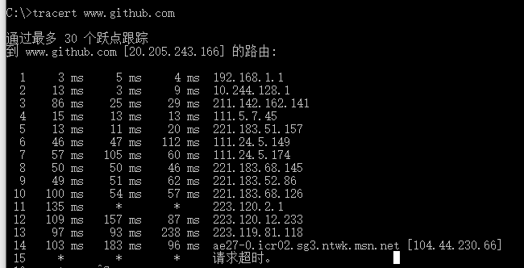

- 假定在源主机和目的主机之间 N-1 台路由 我们还要假设该网络此时是无拥塞的（因此排队时延是微不足道的 ），在每台 路由器 和源主机上的处理时延是 d_proc , 每台路由器和源主机的输出速率是 R bps. 每条链路的传播时延是 d_prop 节点时延累加起来，得到端到端时延： 

  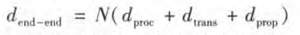

  同样，式中 **d_trans = L/ R** 其中 L 是分组长度 

### 1.4.4 计算机网络中的吞吐量

​	考虑从主机A到主机B 跨越计算机网络传送一个大文件，例如，也许是 P2P 文件共享系统中的一个对等方向另一个对等方传送一个大视频片段。在任何时间瞬间的**瞬时吞吐量 (instantaneous throughput)** 是主机 接收到该文件的速率（以 bps 计） c.. (许多应用程序包括许多 P2P 文件共享系统，其用户界面显示了下载期间的瞬时吞吐量。如果该文件由 **F** 比特组成,主机B接收到所有F比特用去 **T** 秒 则文件传送的平均吞吐量 (average throughput)是 **F / T** bps. 

- 吞吐量是min{R_c,R_s} , 这就是说吞吐量是**瓶颈链路 ( bottleneck link)** 的传输速率 

## 1.5 协议层次机器服务模型

### 1.5.1分层的体系结构

为了给网络协议的设计提供一个结构，网络设计者以**分层 (layer)** 的方式组织协议以及实现这些协议的网络硬件和软件 。我们再次关注某层向它的上一层提供的**服务 (service** , 即所谓一层的**服务模型 (service model)** 。

1. 协议分层

- 应用层 （例如`http`协议、`FTP`协议）
- 运输层（进程到进程）（`TCP` 和`UDP`）
- 网络层（端到端`ETE`） 著名的`IP`协议
- 链路层 （point to point `PTP`）链路层分组称为 **帧**
- 物理层 （电磁波，线路上传输bit）

2. OSI模型

应用层、表示层、会话层、运输层、网络层、链路层、物理层

​	表示层的作用是使通信的应用程序能够解释交换数据的含义，这些服务包括数据压缩和数据加密（它们是自解释的）以及数据描述（这使得应用程序不必担心在各台计算机中表示／ 存储的内部格式不同的问题；

​	会话层提供了数据交换的定界和同步功能，包括了建立检查点和恢复方案的方法。

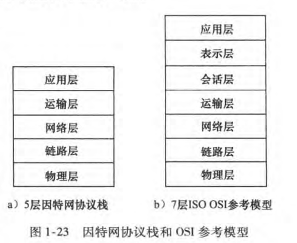

### 1.5.2 封装

封装和解封装如下：

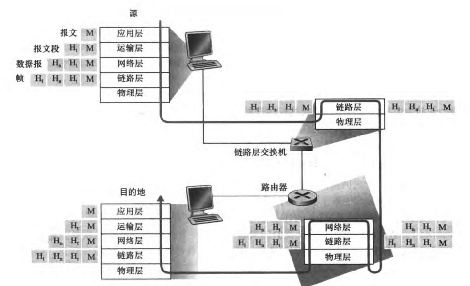

各层次的协议数据单元：

- 应用层：报文(**message**）
- 传输层：报文段(**segment**)：TCP段，UDP数据报 
- 网络层：分组**packet**（如果无连接方式：数据报 **datagram**） 
- 数据链路层：帧(**frame**)
- 物理层：位(**bit**)

## 小结

- **Internet**是由结点和边组成的

  **结点**

  - 主机及其上运行的应用程序
  - 路由器、交换机等网络交换设备

  **边**

  - 接入网链路、主机链接到互联网的链路
  - 主干链路：路由器间的链路

