# two-应用层

应用层是协议最多的层次，它包括各种各样的网络应用，并且我们需要知道的是：

​	**网络核心中没有应用层应用**，也就是说，**所有的应用层应用都是在端系统中实现的**。

而当下网络应用纷繁复杂，例如$E-mail$, $Web$, $Internet电话$，$Youtube, Netfilx$

## 2.1 应用层协议原理

### 2.1.1 网络应用程序体系结构

主流的应用架构有：

- 客户-服务器模式$(C/S:client/server)$
- 对等模式$(P2P:Peer To  Peer)$
- 混合体：客户-服务器和对等体系结构

#### 客户-服务器模式

服务器：

- 一直运行
- 固定的$IP$地址和周至的端口号（约定）
- 扩展性：服务器场
  - 数据中心进行扩展
  - 扩展性差

客户端：

- 主动与服务器通信
- 与互联网有间隙性的连接
- 可能是动态$IP$地址
- 不直接与其他客户端通信

#### 对等体($P2P$)体系结构

- 几乎没有一直运行的服务器
- 任意端系统之间可以通信
- 每一个节点可以是客户端也可以是服务器（主要是按照服务情况划分）
  - 自扩展性：新的$peer$节点带来新的服务能力，当然也带来新的服务请求
- 参与的主机间歇性连接可以改变$IP$地址 ，**从而使得其难以管理**

#### 混合体体系结构

##### Napster

- 文件搜索：集中式
  - 主机在中心服务器上注册其资源
  - 主机向中心服务器查询资源位置
- 文件传输：$P2P$
  - 任意$Peer$节点之间

##### 即时通信

- 在线检测：集中
  - 当用户上线时，向中心服务器注册其$IP$地址
  - 当用户和中心服务器联系，以找到其在线好友的位置
- 两个用户之间聊天：$P2P$

### 2.1.2 进程通信

用操作系统的术语来说，进行通信的实际上是 **进程($process$)** 而不是程序。

在两个不同端系统上的进程，通过跨越计算机网络交换**报文($Message$)**而相互通信。

**客户端进程**：发起通信的进程；**服务器进程**：等待连接的进程

分布式进程通信需要解决的三个问题：

- 进程标示和寻址问题（服务用户） 
- 传输层-应用层提供服务是如何（服务） 
- 如何使用传输层提供的服务，实现应用进 程之间的报文交换，实现应用（用户使用服务） 

#### 问题1：对进程进行编址 ($address$)

- 进程为了接收报文，必须有一个标识 即：$SAP$（发送也需要标示） 
  - 主机：唯一的32位$IP$地址
    - 仅仅有IP地址不能够唯一标示一个进程；在一台端系统上有很 多应用进程在运行。
  - 所采用的传输层协议：$TCP$  $or$  $UDP $
  - 端口号 ($Port Numbers$)
- 从而有一个进程：用 $IP + Port$标示 **端节点**
- 本质上，一对主机进程之间的通信由2个端节点构成

#### 问题2：传输层提供的服务-需要穿过层间的信息

-  层间接口必须要携带的信息
  - 要传输的报文（对本层来说：$SDU$）
  - 谁传的：对方的应用进程的标识 $IP+TCP(UDP)$端口
  - 传给谁：对方的应用进程的标示：对方的$IP+TCP(UDP)$端口号 
- 传输层实体（$TCP$或者$UDP$实体）根据这些信息进行$TCP$ 报文段（$UDP$数据报）的封装 
  - 源端口号，目标端口号，数据等 
  - 将IP地址往下交IP实体，用于封装$IP$数据报：源$IP$,目标$IP$

#### 问题2(续)：传输层提供的服务-层间信息的代表

- 如果$Socket API$每次传输报文，都携带如此多的信息，不容易管理
- 用个代号（一般是个整数）标示通信的双方或单方：$Socket$

#### 问题3：如何使用传输层提供的服务实现应用 

- 定义应用层协议：报文格式，解释，时序等
- 编制程序，通过API调用网络基础设施提供通信服务传报文，解析报文，实现应用时序等

#### $TCP$  $Socket$

  - $tcp$服务，两个进程之间的通信需要之前要建立连接
    - 两个进程通信会持续一段时间，通信关系稳定
  - 可以用一个整数表示两个应用实体之间的通信关系 ，**本地标示** 
  - 穿过层间接口的信息量**最小** 
  - $TCP$ $socket$：(源IP,源端口,目标IP,目标端口 ) 四元组

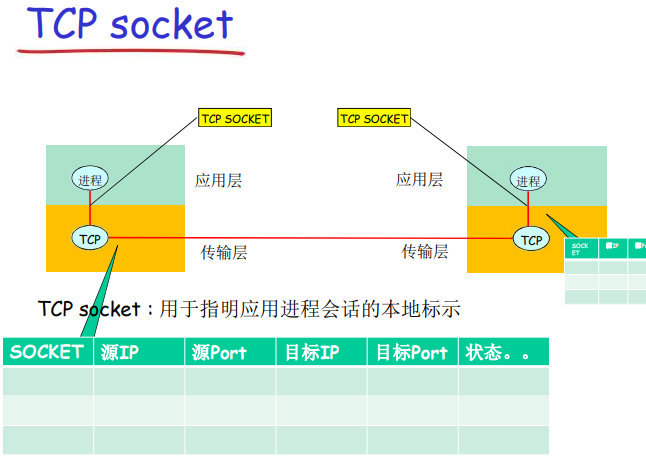

#### $UDP$ $Socket$

- $UDP$ 服务，两个进程之间的通信需要之前无需建立连接
  - 每个报文都是独立传输的
  - 前后报文可能给不同的分布式进程
- 因此只能用一个整数表示本应用实体的标示
- 穿过层间接口的信息大小**最小**
- $UDP$ $Socket$ ： 本$IP$，本端口
- 到那时传输报文的时候，必须提供对方的$IP$，$Port$
  - 接收报文的时候，传输层需要上传对方的$IP$,$Port$

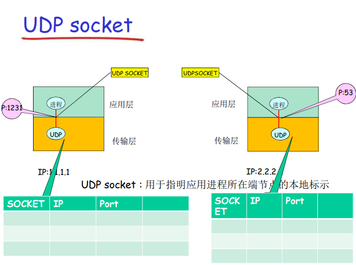

### 2.1.3 可供应用使用的运输服务

描述传输层服务的指标：

- 数据丢失率
  - 有些应用则要求100%的可 靠数据传输（如文件） 
  - 有些应用（如音频）能容忍 一定比例以下的数据丢失 
- 延迟
  - 一些应用由于出于有效性考虑，对于数据传输由严格的时间限制
- 吞吐
  - 一些应用（如多媒体）必须 需要最小限度的吞吐，从而 使得应用能够有效运转 
  - 一些应用能充分利用可供使 用的吞吐(弹性应用）
- 安全性
  - 机密性
  - 完整性
  - 可认证性（鉴别）

### 2.1.4 $Internet$传输层提供的服务

#### $Tcp$提供的服务

- 可靠的传输服务
- 流量控制：发送方不会淹没接收方
- 拥塞控制：当网络出现拥塞时，能抑制发送方
- 不能提供的服务：时间保证、最小吞吐保证和安全
- 面向对象连接：要求在客户端 进程和服务器进程之间建立连接 

#### $UDP$服务：

- 不可靠数据传输 
- 不提供的服务：可靠， 流量控制、拥塞控制、 时间、带宽保证、建立 连接 

#### $UDP$存在的必要性

- 能够区分不同的进程，而IP服务不能 
  - 在IP提供的主机到主机端到端功能的基础上，区分了主机的 应用进程 
- **无需建立连接**，省去了建立连接时间，适合事务性的 应用 
- **不做可靠性的工作**，例如检错重发，适合那些对实时 性要求比较高而对正确性要求不高的应用 
  - 因为为了实现可靠性（准确性、保序等），必须付出时间代 价（检错重发） 
- 没有拥塞控制和流量控制，**应用能够按照设定的速度 发送数据** 
  - 而在TCP上面的应用，应用发送数据的速度和主机向网络发送 的实际速度是不一致的，因为有流量控制和拥塞控制 

#### 安全$TCP$

##### $TCP$ & $UDP$

- 都没有加密
- 明文通过互联网传输，甚至密码

##### $SSL$

- 在TCP上面实现，提供加密的 $TCP$ 连接 
- 私密性
- 数据完整性
- 端到端的鉴别

### 2.1.5 应用层协议

- 定义了：运行在不同端系统上 的应用**进程**如何相互交换报文 
  - 交换的 **报文类型**：请求和应答报文
  - 各种报文类型的 **语法**：报文中的各个字段及其描述
  - 字段的 **语义**： 即字段取值的含义
  - 进程何时、如何发送报文及对报文进行相应的 **规则**
- 应用协议仅仅是应用的一个组成部分

协议同样分成公开协议和私有协议

- 公开协议：
  - 由$RFC$文档定义
  - 允许互操作
  - 如$HTTP$ ，$SMAP$
- 专用协议：
  - 协议不公开
  - 如：$Skype$

## 2.2 $web$和$HTTP$

一些术语：

- $web$页：由一些对象组成
- 对象可以是HTML文件、JPEG图像、Java小程序、声音剪辑文件等 
- Web页含有一个基本的HTML文件，该基本HTML文 件又包含若干对象的引用（链接）
- 通过URL对每个对象进行引用 
  - 访问协议，用户名，口令字，端口等 
- URL格式: 

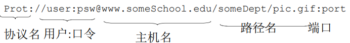

### 2.2.1 $HTTP$ 概况

$HTTP$: 超文本传输协议

- $Web$的应用层协议
- 客户/服务器模式
  - 客户：请求、接受和显示
  - 服务器：对请求进行响应
- $HTTP 1.0$ : $RFC 1945$
- $HTTP1.1$ : $RFC 2068$

使用$TCP$：

- 客户发起一个与服务器的 TCP连接 (建立套接字) ， 端口号为 80 
- 服务器接受客户的TCP连 接 
- 在浏览器(HTTP客户端) 与 Web服务器(HTTP服 务器 server)交换HTTP 报文 (应用层协议报文)  
- TCP连接关闭 

$HTTP$是无状态的。

### 2.2.2 $HTTP$连接

#### 非持久$HTTP$

- 最多只有一个对象在$TCP$连接上发送
- 下载多个对象需要多个$TCP$连接
- $HTTP/1.0$使用非持久连接

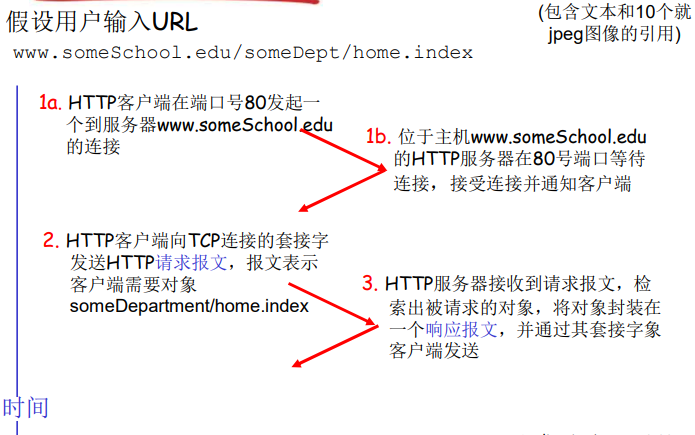

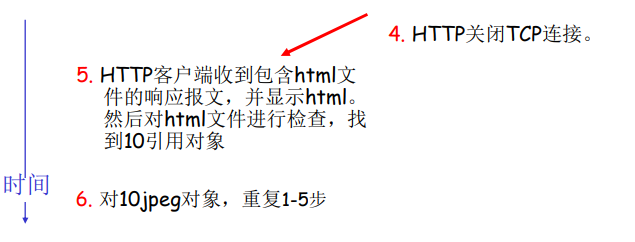

#### 非持久化$HTTP$的缺点

- 每个对象要两个$RRT$
- 操作系统必须为每个$TCP$连接分配资源
- 但浏览器通常打开并行$TCP$连接 ，以获取引用对象 

#### 持久$HTTP$

- 多个对象可以在一个(在客户端和服务器之间的)$TCP$连接上传输
- $HTTP/1.1$默认使用持久连接
- 服务器在发送响应后，仍保持 TCP连接 
- 在相同客户端和服务器之间的后续请求和响应报文通过相同的连接进行传送 
- 客户端在遇到一个引用对象的时候，就可以尽快发送该对象的请求 

##### 非流水方式的持久$HTTP$

- 客户端只能在收到前一个响应后才能发出新的请求
- 每个引用对象花费一个RTT 

##### 流水方式的持久$HTTP$

- HTTP/1.1的默认模式 
- 客户端遇到一个引用对象就立即 产生一个请求 
- 所有引用（小）对象只花费一个 RTT是可能的 

#### 响应事件模型

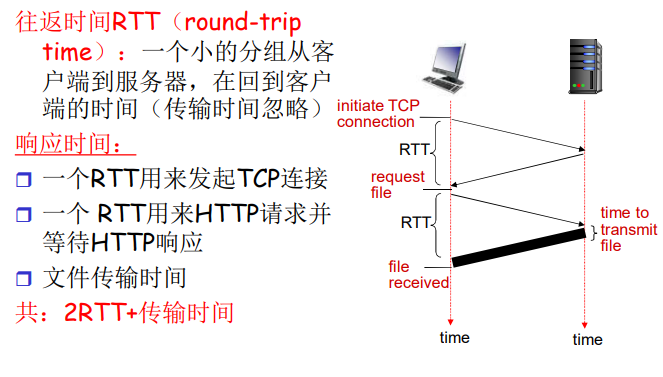

### 2.2.3 $HTTP$报文格式

#### 请求报文

格式如下:

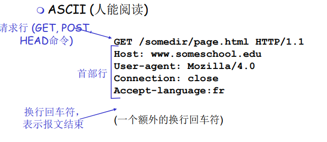

#### 响应报文

格式如下：

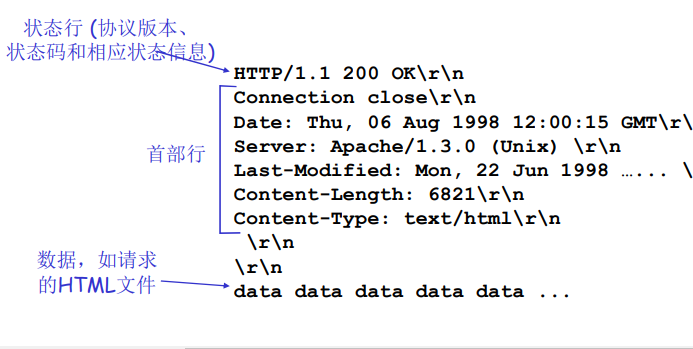

#### 常见的状态码：

位于服务器$\rightarrow$客户端的响应报文中的首行 

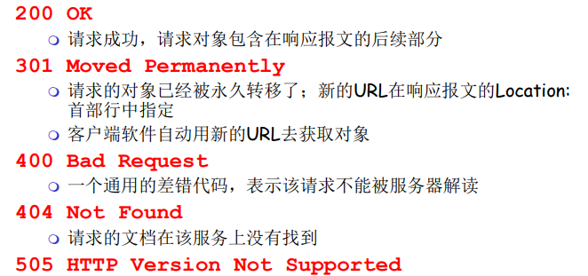

### 2.2.4 用户与服务器的交互：$cookie$

#### $cookie$的四个组件

- 在HTTP响应报文中有 一个cookie的首部行 
- 在HTTP请求报文含有 一个cookie的首部行 
-  在用户端系统中保留有 一个cookie文件，由用 户的浏览器管理 
- 在Web站点有一个后 端数据库 

过程如图所示：

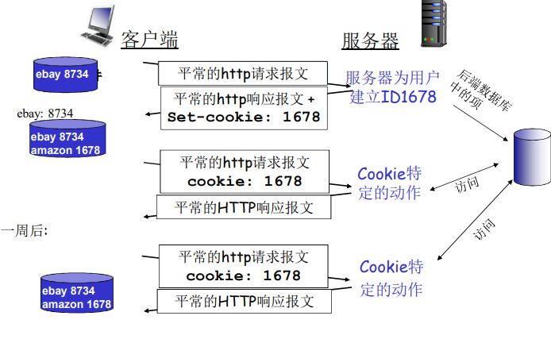

#### $Cookies$能带来什么

- 用户验证
- 购物车
- 推荐
- 用户状态

#### $cookies$与隐私

- Cookies允许站点知道许多关于 用户的信息 
- 可能将它知道的东西卖给第三 方 
- 使用重定向和cookie的搜索引 擎还能知道用户更多的信息 
  - 如通过某个用户在大量站点 上的行为，了解其个人浏览 方式的大致模式 
- 广告公司从站点获得信息 

### 2.2.5 $Web$缓存（代理服务器）

目的：不访问原始服务器，就满足客户的请求 

- 用户设置浏览器：通过缓存访问$web$
- 浏览器将所有的$HTTP$请求发给缓存
  - 在缓存中的对象：缓存直接返回对象
  - 如对象不在缓存，缓存请求原始服务器，然后将对象返回给客户端

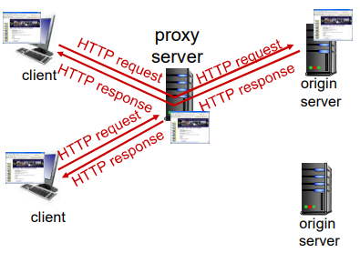

为什么要用$web$缓存？

- 降低客户端的请求响应时间
- 可以大大减少一个机构内部网络与$Internet$接入链路上的流量
- 互联网大大采用了缓存：可以使较弱的$ICP$也能够提供有效的内容

#### 2.2.6 条件$GET$方法

- 目标：如果缓存器中的对 象拷贝是最新的，就不要 发送对象 
- 缓存器：在HTTP请求中指 定缓存拷贝的日期 `If-modified-since `
- 服务器：如果缓存拷贝陈 旧，则响应报文没包含对 象:  `HTTP/1.0 304 Not  Modified`

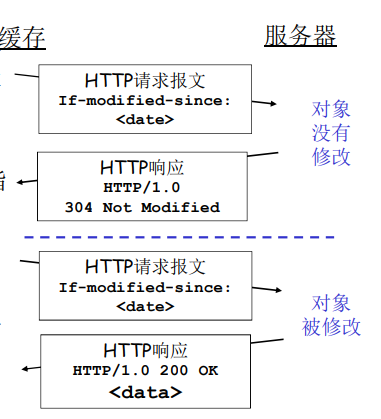

## 2.3 因特网中的电子邮件

电子邮件很显然是 **异步通信**。

主要有三个组成部分：用户代理($user agent$)、 邮件服务器 ($mail $ $server$)、**简单邮件传输协议($Simple$ $Mail$ $Transfer$ $Protocol$ , $SMTP$)**

### 2.3.1 $SMTP$

简单邮件传输协议：$SMTP$ 其是因特网电子邮件的核心

- 使用TCP在客户端和服务器之间传送报文，端口 号为25 
- 直接传输：从发送方服务器到接收方服务器 
- 传输的3个阶段 
  - 握手
  - 传输报文
  - 关闭
- 命令/响应交互 
  - 命令：ASCII文本 
  - 响应：状态码和状态信息 
- 报文必须为7位$ASCII$码 

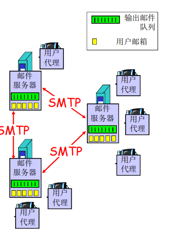

### 2.3.2与$HTTP$的对比

- HTTP：拉（pull） 
- SMTP：推（push） 
- 二者都是ASCII形式的命令/ 响应交互、状态码 
- HTTP：每个对象封装在各自 的响应报文中 
- SMTP：多个对象包含在一个 报文中 

### 2.3.3邮件报文格式

### 2.3.4邮件访问协议

邮件访问协议：从服务器访问邮件 

- POP：邮局访问协议（Post Office Protocol）[RFC 1939] 
  - 用户身份确认 (代理<-->服务器) 并下载 
- IMAP：Internet邮件访问协议（Internet Mail Access  Protocol）[RFC 1730] 
  - 更多特性 (更复杂) 
  - 在服务器上处理存储的报文 
- HTTP：Hotmail , Yahoo! Mail等 
  - 方便

## 2.4 DNS:因特网的目录服务

$DNS(Domain\quad Name \quad System)$域名系统

主机标示方法有两种

- 主机名 ($Hostname$) 如$www.facebook.com$
- $IP$地址

$DNS$的必要性：

- IP地址标识主机、路由器 
- 但IP地址不好记忆，不便人类使用(没有意义) 
- 人类一般倾向于使用一些有意义的字符串来标识 Internet上的设备 
- 存在着“字符串”—IP地址的转换的必要性 
- 人类用户提供要访问机器的“字符串”名称 
- 由DNS负责转换成为二进制的网络地址 

### $DNS$的总体思路和目标

#### 主要思路

- **分层的**、基于域的命名机制 
- 若干**分布式**的数据库完成名字到IP地址的转换 
- 运行在$UDP$之上**端口号为53**的应用服务 
- 核心的$Internet$功能，但是以用户层协议实现

#### 主要目的

- 实现主机名-IP地址的转换($name/ IP\quad translate$) 
- 其它目的 
  - **主机别名**到**规范名字**的转换
  - **邮件服务器别名**到**邮件服务器的正规名字**的转换
  - **负载均衡**

### 问题一：$DNS$的命名空间

#### $DNS$域名结构

- 一个层面命名设备会有很多重名 
- $DNS$采用层次树状结构的命名方法
- $Internet$根被划为几百个顶级域(**top lever domains**) 
  - 通用的(**generic**)
    - .com; .edu ; .gov ; .int ; .mil ; .net ; .org .firm ; .hsop ; .web ; .arts ; .rec ; 
  - 国家的(**countries**) 
    - .cn ; .us ; .nl ; .jp 
- 每个(子)域下面可划分为若干子域(**subdomans**)
- 树叶是主机

#### 域名(Domain Name)

- 从本域往上，直到树根 
- 中间使用**“.”**间隔不同的级别 
- 域的域名：可以用于表示一个域 
- 主机的域名：一个域上的一个主机 

#### 域名的管理

- 一个域管理其下的子域 
  - .jp 被划分为 ac.jp co.jp 
  - .cn 被划分为 edu.cn com.cn 
- 创建一个新的域，必须征得它所属域的同意 

#### 域与物理网络无关

- 域遵从组织界限，而不是物理网络 
  - 一个域的主机可以不在一个网络 
  - 一个网络的主机不一定在一个域 
- 域的划分是逻辑的，而不是物理的 

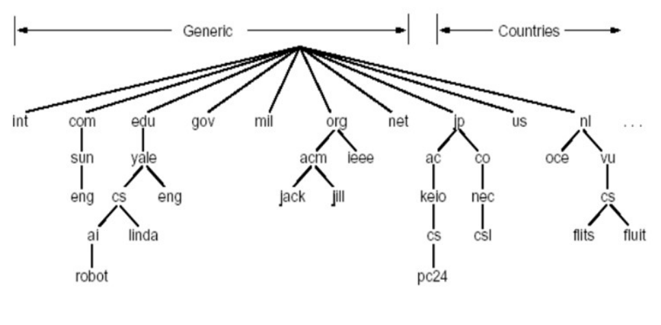

### 问题二：解析问题-名字服务器（**Name Server**）

#### 一个名字服务器的问题 

- 可靠性问题：单点故障 
- 扩展性问题：通信容量 
- 维护问题：远距离的集中式数据库

#### 区域(zone) 

- 区域的划分有区域管理者自己决定 
- 将DNS名字空间划分为互不相交的区域，每个区域都是树的一部分 
- 名字服务器：
  - 每个区域都有一个名字服务器：维护着它所管辖区域的权威信息 (**authoritative** **record**) 
  - 名字服务器允许被放置在区域之外，以保障可靠性 

#### $TLD$服务器

顶级域($TLD$)服务器：负责顶级域名（如com, org, net,  edu和gov）和所有国家级的顶级域名（如cn, uk, fr, ca,  jp ） 

- **Network solutions** 公司维护**com TLD**服务器 
- **Educause**公司维护edu TLD服务器 

#### 区域名字服务器维护资源记录

##### 资源记录(**resource records**) 

- 作用： 维护域名- IP地址（其他）的映射关系
- 位置：Name Server 的分布式数据库中

##### RR格式: (domain_name, ttl, type,class,Value) 

- **Domain_name**:域名
- **TTL:time to live**:生存时间
- **Class**类别：对于$Internet$，值为$IN$
- **Value值**：可以是数字，域名或$ASCII$串
- **Type**:类别：资源记录的类型

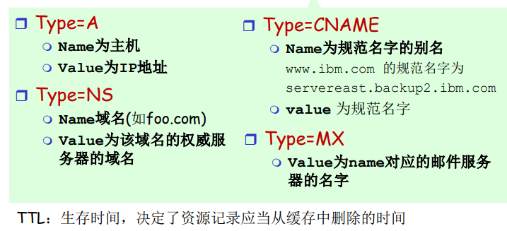

**TTL**一般设置为两天

#### DNS大致工作过程

- 应用调用解析器(**resolver**)
- 解析器作为用户向 Name Server 发出查询报文( 封装在UDP段中)
- Name Server返回响应报文(name/ip)

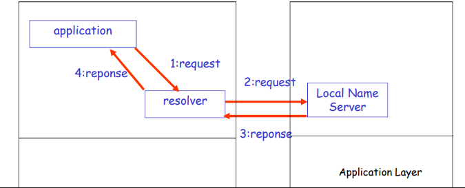

#### 本地名字服务器(Local Name Server)

- 并不严格属于层次结构
- 每个ISP (居民区的ISP、公司、大学）都有一 个本地DNS服务器 
- 当一个主机发起一个DNS查询时，查询被送到 其本地DNS服务器 
  - 起着代理的作用，将查询转发到层次结构中 

#### 名字服务器(Name Server)

##### 名字解析过程

- 目标名字在Local Name Server中 
  - 情况1：查询的名字在该区域内部 
  - 情况2：缓存(cashing) 

当与本地名字服务器不能解析 名字时，联系根名字服务器 顺着根-TLD 一直找到 权威名 字服务器 

查询方式有两种，一种是递归查询，一种是迭代查询

##### 递归查询

- 名字解析负担都 放在当前联络的 名字服务器上 
- 问题：根服务器 的负担太重 
- 解决：迭代查询

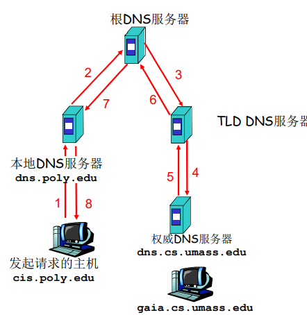

##### 迭代查询

- 根（及各级域名）服务器返回的不是查询结果，而是下一个NS的地址 
- 最后由权威名字服务器给 出解析结果 
- 当前联络的服务器给出可 以联系的服务器的名字 
- “我不知道这个名字，但 可以向这个服务器请求” 

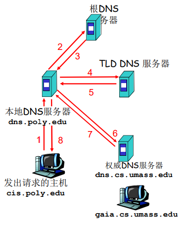

#### $DNS$协议、报文

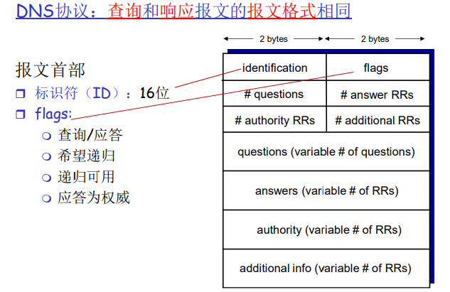

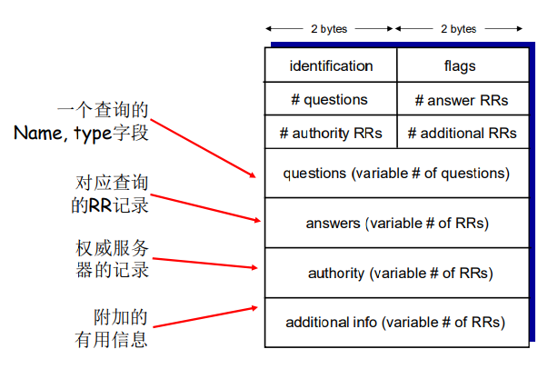

#### 提高性能：缓存

- 一旦名字服务器学到了一个映射，就将该映射 **缓存**起来 
- 根服务器通常都在本地服务器中缓存着 
  - 使得根服务器不用经常被访问 
- 目的：提高效率 
- 可能存在的问题：如果情况变化，缓存结果和 权威资源记录不一致 
- 解决方案：TTL（默认2天） 

### 问题三：维护问题：新增一个域

- 在上级域的名字服务器中增加两条记录，指向这个新增的子域的域名和域名服务器的地址
- 在新增子域的名字服务器上运行名字服务器，负责本域的名字解析：名字->IP地址
- 到注册登记机构注册域名networkutopia.com 
  - 需要向该机构提供权威DNS服务器（基本的、和辅助的）的名字和IP地址 
  - 登记机构在com TLD服务器中插入两条RR记录 
- 在networkutopia.com的权威服务器中确保有 
  - 用于Web服务器的  www.networkuptopia.com的类型为A的记录 
  - 用于邮件服务器mail.networkutopia.com的类型为MX的记录 

### 攻击$DNS$

#### $DDos$攻击

- 对根服务器进行流量轰炸 攻击：发送大量ping 
  - 没有成功 
  - 原因１：根目录服务器配置 了流量过滤器，防火墙 
  - 原因２：Local DNS 服务器 缓存了TLD服务器的IP地址,  因此无需查询根服务器 
- 向TLD服务器流量轰炸攻击 ：发送大量查询 
  - 可能更危险 
  - 效果一般，大部分DNS缓存 了TLD 

#### 重定向攻击

- 中间人攻击 
  - 截获查询，伪造回答，从而攻击 某个（DNS回答指定的IP）站点 
- DNS中毒 
  - 发送伪造的应答给DNS服务器，希 望它能够缓存这个虚假的结果 
- 技术上较困难：分布式截获和伪造 利用DNS基础设施进行DDoS 
- 伪造某个IP进行查询 ，攻击这个目标IP
- 查询放大，响应报文比查询报文大 
- 效果有限 

## 2.5 $P2P$文件分发

纯$P2P$架构

- 没有（或极少）一直运行的 服务器 
- 任意端系统都可以直接通信 
- 利用peer的服务能力 
- Peer节点间歇上网，每次IP 地址都有可能变化 

### 2.5.1文件分发时间

#### C/S模式

- 服务器传输： 都是由服务器发送给peer，服务器必须顺序 传输（上载）N个文件拷贝: 
  - 发送一个copy: $F/U_s$
  - 发送$N$个copy:$NF/U_s$
- 客户端: 每个客户端必须下载一个文件拷贝
  - $d_{min}$ = 客户端最小的下载速率
  - 下载带宽最小的客户端下载的 时间：$F/d_{min }$
- 总计将一个$F$大小的文件分发给$N$个客户端耗时：

$$
D_{C-S}\ge max\{NF/U_s,F/d_{min}\}
$$

#### $P2P$模式

- **服务器传输**：最少需要上载一份 拷贝 
  - 发送一个拷贝的时间: $F/U_s$
- **客户端**: 每个客户端必须下载一个拷贝
  - 最小下载带宽客户单耗时:$F/d_{min}$
- **客户端**: 所有客户端总体下载量$NF$
  - 最大上载带宽是 $u_s+\sum_iu_i$
  - 除了服务器可以上载，其他所有的$peer$节点都可以上载 
- 总计将一个$F$大小的文件分发给$N$个客户端耗时：

$$
D_{P2P} \ge max\{f/u_s,f/d_{min},NF/(U_s,\sum u_i)\}
$$

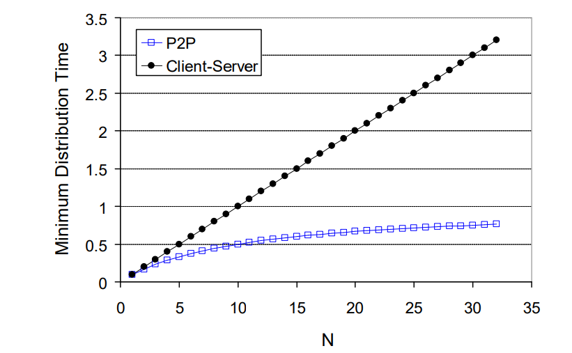

