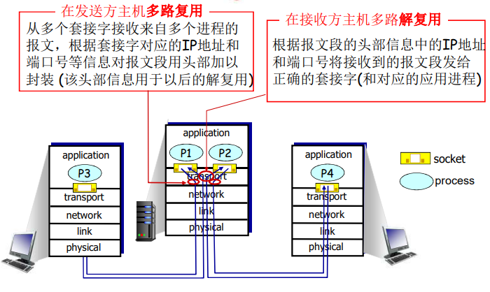
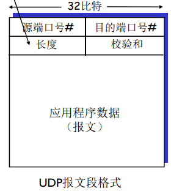
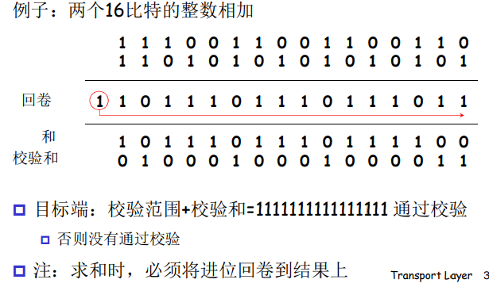

# Three-传输层

运输层位于**应用层**和**网络层**之间， 是分层的网络体系结构的重要部分。该层为运行在 同主机上的应用进程提供直接的通信服务起着至关重要的作用。

## 3.1 概述和传输层服务

运输层协议为运行在不同 机上的应用进程之间提供了 **逻辑通信(logic communication)**,并且运输层的协议是在端系统中实现的而不是在网络核心中。在发送端，运输 将从发送应用程序进程接收到的报文转换成运输层分组，用因特网术语来讲该分组称为 运输层报文段 (**segment**).并且有多个传输层协议可供选择：**Internet**: $TCP$和$UDP$

### 3.1.1 传输层和网络层的关系

- 网络层的服务：主机之间的逻辑通信
- 传输层的服务：进程之间的逻辑通信
  - 依赖于网络层的服务
    - 延时、带宽
  - 并且对网络层的服务进行增强
    - 数据丢失、顺序混乱、加密

有些服务是可以加强的：不可靠->可靠、安全

但有些服务是不可以被加强的：带宽、延迟

### 3.1.2 Internet传输层概述

- 可靠的、保序的传输： $TCP$
  - 多路复用、解复用
  - 拥塞控制
  - 流量控制
  - 建立连接
- 不可靠、不保序的传输： $UDP$
  - 多路复用、解复用
  - 没有为尽力而为的$IP$服务添加更多的其他额外的服务
- 都不提供的服务：
  - 延时保证
  - 带宽保证

## 3.2 多路复用与解复用

#### 多路解复用工作原理

- 解复用作用：$TCP$或者$UDP$实体采用哪些信息，将报文段的数据部分交给正确的$socket$，从而交给正确的进程
- 主机收到$IP$数据报
  - 每个数据报有源$IP$地址和目标地址
  - 每个数据报承载一个传输层报文段
  - 每个报文段有一个源端口号和目标端口号，（特定应用有著名的端口号）
- 主机联合使用**IP地址**和**端口号**将报文段发送给合适的套接字

#### 无连接(**UDP**)多路解复用

- 创建套接字：
- 在接收端，$UDP$套接字用二元组标识**(目标IP地址、目标端口号)**
- 当主机收到$UDP$报文段
  - 检查报文段的目标端口号
  - 用该端口号将报文段定位给套接字
- 如果两个不同$IP$地址/源端口号的数据包，但是有**相同的目标$IP$地址和端口号**，则被定位到相同的套接字

#### 面向连接(TCP)的多路解复用

- TCP套接字：四元组本地标识
  - 源IP地址
  - 源端口号
  - 目标IP地址
  - 目标端口号
- **解复用**：接收主机用这四个值来将数据报定位到合适的套接字
- 服务器能够在一个TCP端口上同时支持多个TCP套接字： 
  - 每个套接字由其四元组标 识（有不同的源**IP**和源**PORT**） 
- Web服务器对每个连接 客户端有不同的套接字 
  - 非持久对每个请求有不同的套接字 

## 3.3 无连接传输：UDP

“尽力而为”的服务，报文可能发生丢失、送到应用进程的报文段乱序

**无连接**

- UDP发送端和接收端之间没有握手
- 每个UDP报文段都被独立的处理

UDP常用于：

- 流媒体（丢失不敏感，速率敏感，应用可控制传输速率）
- DNS
- SNMP

在**UDP**上可行可靠的传输需要在应用层增加可靠性，应用特定的差错恢复

#### UDP存在的原因

- 关于发送什么数据以及何时发送的应用层控制更为精细
- 无需建立连接
- 无连接状态：在发送端和接收端没有连接状态
- 分组首部开销小
- 无拥塞控制和流量控制，可以尽可能块的发送报文段

### 3.3.1 UDP报文段结构

### 3.3.2 UDP 检验和

**目标**：检测在被传输报文段中的差错

发送方：

- 将报文段的内容视为16bit的整数
- 检验和：报文段的加法和（1的补运算）
- 发送方将检验和放在UDP的校验和字段

接收方：

- 计算接收到的报文段的校验和
- 检查计算出的校验和与校验 和字段的内容是否相等： 
  - 不相等–--检测到差错 
  - 相等–--没有检测到差错 ，但也许还是有差错 
    - 残存错误 （就是错的惊人的一致）

注意：当数字相加时，**在最高位的进位要回卷，再加到结果上** 

例子如下：

## 3.4 可靠数据传输的原理

