# Three-传输层

运输层位于**应用层**和**网络层**之间， 是分层的网络体系结构的重要部分。该层为运行在 同主机上的应用进程提供直接的通信服务起着至关重要的作用。

## 3.1 概述和传输层服务

运输层协议为运行在不同 机上的应用进程之间提供了 **逻辑通信(logic communication)**,并且运输层的协议是在端系统中实现的而不是在网络核心中。在发送端，运输 将从发送应用程序进程接收到的报文转换成运输层分组，用因特网术语来讲该分组称为 运输层报文段 (**segment**).并且有多个传输层协议可供选择：**Internet**: $TCP$和$UDP$

### 3.1.1 传输层和网络层的关系

- 网络层的服务：主机之间的逻辑通信
- 传输层的服务：进程之间的逻辑通信
  - 依赖于网络层的服务
    - 延时、带宽
  - 并且对网络层的服务进行增强
    - 数据丢失、顺序混乱、加密

有些服务是可以加强的：不可靠->可靠、安全

但有些服务是不可以被加强的：带宽、延迟

### 3.1.2 Internet传输层概述

- 可靠的、保序的传输： $TCP$
  - 多路复用、解复用
  - 拥塞控制
  - 流量控制
  - 建立连接
- 不可靠、不保序的传输： $UDP$
  - 多路复用、解复用
  - 没有为尽力而为的$IP$服务添加更多的其他额外的服务
- 都不提供的服务：
  - 延时保证
  - 带宽保证

## 3.2 多路复用与解复用


#### 多路解复用工作原理

- 解复用作用：$TCP$或者$UDP$实体采用哪些信息，将报文段的数据部分交给正确的$socket$，从而交给正确的进程
- 主机收到$IP$数据报
  - 每个数据报有源$IP$地址和目标地址
  - 每个数据报承载一个传输层报文段
  - 每个报文段有一个源端口号和目标端口号，（特定应用有著名的端口号）
- 主机联合使用**IP地址**和**端口号**将报文段发送给合适的套接字

#### 无连接(**UDP**)多路解复用

- 创建套接字：
- 在接收端，$UDP$套接字用二元组标识**(目标IP地址、目标端口号)**
- 当主机收到$UDP$报文段
  - 检查报文段的目标端口号
  - 用该端口号将报文段定位给套接字
- 如果两个不同$IP$地址/源端口号的数据包，但是有**相同的目标$IP$地址和端口号**，则被定位到相同的套接字

#### 面向连接(TCP)的多路解复用

- TCP套接字：四元组本地标识
  - 源IP地址
  - 源端口号
  - 目标IP地址
  - 目标端口号
- **解复用**：接收主机用这四个值来将数据报定位到合适的套接字
- 服务器能够在一个TCP端口上同时支持多个TCP套接字： 
  - 每个套接字由其四元组标 识（有不同的源**IP**和源**PORT**） 
- Web服务器对每个连接 客户端有不同的套接字 
  - 非持久对每个请求有不同的套接字 

## 3.3 无连接传输：UDP

“尽力而为”的服务，报文可能发生丢失、送到应用进程的报文段乱序

**无连接**

- UDP发送端和接收端之间没有握手
- 每个UDP报文段都被独立的处理

UDP常用于：

- 流媒体（丢失不敏感，速率敏感，应用可控制传输速率）
- DNS
- SNMP

在**UDP**上可行可靠的传输需要在应用层增加可靠性，应用特定的差错恢复

#### UDP存在的原因

- 关于发送什么数据以及何时发送的应用层控制更为精细
- 无需建立连接
- 无连接状态：在发送端和接收端没有连接状态
- 分组首部开销小
- 无拥塞控制和流量控制，可以尽可能块的发送报文段

### 3.3.1 UDP报文段结构


### 3.3.2 UDP 检验和

**目标**：检测在被传输报文段中的差错

发送方：

- 将报文段的内容视为16bit的整数
- 检验和：报文段的加法和（1的补运算）
- 发送方将检验和放在UDP的校验和字段

接收方：

- 计算接收到的报文段的校验和
- 检查计算出的校验和与校验 和字段的内容是否相等： 
  - 不相等–--检测到差错 
  - 相等–--没有检测到差错 ，但也许还是有差错 
    - 残存错误 （就是错的惊人的一致）

注意：当数字相加时，**在最高位的进位要回卷，再加到结果上** 

例子如下：


## 3.4 可靠数据传输的原理

可靠数据传输协议（**reliable data transfer protocol**）,**RDT**在应用层、传输层和数据链路层都很重要.

### 3.4.1 构建可靠数据传输协议

#### 问题描述


我们将

- 渐增式地开发可靠数据传输协议（ rdt ）的发送方和接 收方 
- 只考虑单向数据传输
  - 但是控制信息是双向流动的
- 双向的数据传输问题实际上是2个单向数据传输问题的综合 
- 使用有限状态机 (FSM) 来描述发送方和接收方 


#### 1 在可靠信道上的可靠数据传输 Rdt 1.0

**假设**

- 下层的信道是完全可靠的
  - 没有比特出错
  - 没有分组的丢失
- 发送方和接收方的FSM
  - 在可靠信道上的可靠数据传输 
  - 接收方从下层信道接收数据 


#### 2 具有比特差错的信道 Rdt 2.0->Rdt 2.2

##### rdt 2.1: 起步

**假设**

- 下层信道可能会出错：将分组中的比特翻转 
  - 用校验和来检测比特差错 
- 问题：怎样从差错中恢复： 
  - **确认(ACK)**：接收方显式地告诉发送方分组已被正确接收
  - **否定确认( NAK):** 接收方显式地告诉发送方分组发生了差错，发送方收到NAK后，发送方重传分组 
-  **rdt2.0**中的新机制：采用差错控制编码进行差错检测 
  - 发送方差错控制编码、缓存 
  - 接收方使用编码检错 
  - 接收方的反馈：控制报文（ACK，NAK）：接收方->发送方 
  - 发送方收到反馈相应的动作 


##### rdt 2.1: 一些改进

如果ACK/NAK出错？

- 发送方不知道接收方发 生了什么事情！ 
- 发送方如何做 
  - 重传？可能重复 
  - 不重传？可能死锁(或出 错) 
- 需要引入新的机制 
  - 序号 

处理重复：

- 发送方在每个分组中加 入序号 
- 如果ACK/NAK出错，发 送方重传当前分组 
- 接收方丢弃（不发给上 层）重复分组 


##### rdt 2.2: 无NAK的协议

- 功能同rdt2.1，但只使用ACK（ack要编号）
- 接收方对最后正确接收的分组发ACK，以替代NAK 
  - 接收方必须显式地包含被正确接收分组的序号 
- 当收到重复的ACK（如：再次收到ack0）时，发送 方与收到NAK采取相同的动作：重传当前分组 
- 为后面的一次发送多个数据单位做一个准备 
  - 一次能够发送多个 
  - 每一个的应答都有：ACK，NACK；麻烦 
  - 使用对前一个数据单位的ACK，代替本数据单位的nak 
  - 确认信息减少一半，协议处理简单 


#### 3 具有比特差错和分组丢失的信道 Rdt 3.0

**新的假设**： 下层信道可能会丢失分组（数据或ACK） 

- 会死锁
- 机制还不够处理这种情况
  - 检验和
  - 序列号
  - ACK
  - 重传

方法：发送方等待ACK一段合理的时间 

- 发送端超时重传：如果到时没有 收到ACK->重传 
- 问题：如果分组（或ACK ）只 是被延迟了： 
  - 重传将会导致数据重复，但 利用序列号已经可以处理这 个问题 
  - 接收方必须指明被正确接收 的序列号 
- 接收方必须指明被正确接收 的序列号 

**链路层的timeout时间确定的 传输层timeout时间是适应式的** 


##### rdt 3.0 运行


上述讨论的就是停止等待协议**（stop-and-wait）**

### 3.4.2 流水线可靠数据传输协议

#### rdt 3.0 性能分析


经过上面分析可以看出来，**瓶颈**在于：网络协议限制了物理资源的利用！

那么不妨采用**流水线**来**提高链路利用率**


- 增加$n$，能提高链路利用率
- 但是当达到某个$n$，其$u = 100\%$ 时，无法再通过增加$n$，提高利用率
- 瓶颈转移到了-》链路带宽

#### 基本概述

**流水线**：允许发送方再**未得到对方确认**的情况下一次发送多个分组

- 必须增加序号的范围:用多个bit表示分组的序号 
- 在发送方/接收方要有缓冲区 
  - 发送方缓冲：未得到确认，可能需要重传； 
  - 接收方缓存：上层用户取用数据的速率≠接收到的数据速率；接收到的数据可 能乱序，排序交付（可靠） 
- 两种通用的流水线协议： **回退$N$步（GBN）**和**选择重传(SR)**


### 3.4.3 回退N步

在此协议中，允许发送方发送多个分组（当有多个分组可用时）而不需等待确认，但它受限于在流水线中未确认的分组数不能超过某个最大允许数Ｎ

#### 通用：滑动窗口(**slide window**)协议

- 发送缓冲区
  - 形式：内存中的一个区域，落入缓冲区的分组可以发送 
  - 功能：用于存放已发送，但是没有得到确认的分组 
  - 必要性：需要重发时可用
- 发送缓冲区的大小：一次最多可以发送多少个未经确认的分组
  - stop and wait 协议 = 1
  - popline 协议 >1,合理的值不能很大，链路利用率不能超过$100\%$
- 发送缓冲区中的分组 
  - **未发送的**：落入发送缓冲区的分组，可以连续发送出去
  - **已经发送出去的、等待对方确认的分组**：发送缓冲区的分组只有得到确认 才能删除 

##### 发送窗口滑动过程-相对表示方法

- 采用相对移动方式表示，分组不动
- 可缓冲范围移动，代表一段可以发送的分组

##### 实现过程描述


- 一开始：没有发送任何一个分组

  - 后沿 = 前沿
  - 之间为发送窗口的尺寸 = 0

- 每发送一个分组，前沿前一个单位

  

- 发送窗口前沿移动的极限：不能够超过发送缓冲区

- 发送窗口后沿移动

  - 条件：收到老分组的确认
  - 结果：发送缓冲区罩住新的分组，来了分组可以发 送 
  - 移动的极限：不能超过前沿

##### 接收窗口

接受窗口 (**receiving window)** = 接收缓冲区

- 接收窗口用于控制哪些分组可以接收
  - 只有收到的分组序号落入接收窗口内才允许接收 
  - 若序号在接收窗口之外，则丢弃 
- 接收窗口尺寸Wr=1，则只能顺序接收 
- 接收窗口尺寸Wr>1 ，则可以乱序接收
  - 但提交给上层的分组，要按序 

##### 接受窗口的滑动和确认

**滑动**

- 低序号的分组到来，接收窗口移动； 
- 高序号分组乱序到，缓存但不交付（因为要实现rdt，不允许失序），不滑动 

**发送确认**

- 接收窗口尺寸=1 ：发送连续收到的最大的分组确认（累计确认） 
- 接收窗口尺寸>1 ：收到分组，发送那个分组的确认（非累计确认） 


##### 正常情况下的2个窗口互动

- 发送窗口
  - 有新的分组落入发送缓冲区范围，发送->前沿滑动 
  - 来了老的低序号分组的确认->后沿向前滑动->新的分组可 以落入发送缓冲区的范围 
- 接受窗口
  - 收到分组，落入到接收窗口范围内，接收 
  - 是低序号，发送确认给对方
- 发送端上面来了分组->发送窗口滑动->接收窗口滑动->发确认 

#### GBN异常情况下的2窗口互动

- 发送窗口
  - 新分组落入发送缓冲区范围，发送->前沿滑动 
  - 超时重发机制让发送端将发送窗口中的所有分组发送出去 
  - 来了老分组的重复确认->后沿不向前滑动->新的分组无法 落入发送缓冲区的范围（此时如果发送缓冲区有新的分组 可以发送） 
- 接收窗口
  - 收到乱序分组，没有落入到接收窗口范围内，抛弃 
  - （重复）发送老分组的确认，累计确认； 

##### 发送方扩展的FSM


##### 接收方扩展的FSM


- 只发送ACK：对顺序接收的最高序号的分组 
  - 可能会产生重复的ACK 
  - 只需记住expectedseqnum；接收窗口=1 即只一个变量就可表示接收窗口 
- 对乱序的分组： 
  - 丢弃（不缓存） $\rightarrow$ 在接收方不被缓存！ 
  - 对顺序接收的最高序号的分组进行确认-累计确认 


### 3.4.4  选择重传SR（select repeat）

- 接收方对每个正确接收的分组，分别发送ACK （非累计确认）
  - 接收窗口>1
    - 可以缓存乱序的分组 
  - 最终将分组按顺序交付给上层 
- 发送方只对那些没有收到ACK的分组进行重 发-选择性重发 
  - 发送方为每个未确认的分组设定一个定时器 
- 发送窗口的最大值（发送缓冲区）限制发送 未确认分组的个数 

##### 发送方

从上层接收数据

- 如果下一个可用于该分组的序 号可在发送窗口中，则发送

**timeout(n)**:重新发送分组n，重新设定定时器 
**ACK(n)**  **in [sendbase,sendbase+N]** 

- 将分组n标记为已接收 
- 如n为最小未确认的分组序号， 将base移到下一个未确认序号 

##### 接收方

**分组n [rcvbase, rcvbase+N-1]**

- 发送**ACK(n)**
- 乱序：缓存
- 有序：该分组及以前缓存的 序号连续的分组交付给上层 ，然后将窗口移到下一个仍未被接收的分组 

**分组  [rcvbase-N, rcvbase-1]** 

- ACK(n)

**其它**:

- 忽略该分组

#### 异常情况下SR的2窗口互动 

- 发送窗口
  - 新分组落入发送缓冲区范围，发送->前沿滑动 
  - 超时重发机制让发送端将超时的分组重新发送出去 
  - 来了乱序分组的确认->后沿不向前滑动->新的分组无法落 入发送缓冲区的范围（此时如果发送缓冲区有新的分组可 以发送） 
- 接受窗口
  - 收到乱序分组，落入到接收窗口范围内，接收 
  - 发送该分组的确认，单独确认 


#### 对比 GBN 和 SR


**适用范围**

- 出错率低：比较适合**GBN**，出错非常罕见，没有必 要用复杂的**SR**，为罕见的事件做日常的准备和复杂处理 
- 链路容量大（延迟大、带宽大）：比较适合**SR**而不是**GBN**，一点出错代价太大 

**GBN**: $2^n -1$

**SR**:$2^{n-1}$

## 3.5 面向连接的传输：$TCP$

### 3.5.1 TCP连接

- 点对点

  - 一个发送方，一个接收方

- 可靠的、按顺序的字节流

  - 没有报文边界

- 管道化（流水线）：

  - TCP拥塞控制和流量控制设置窗口大小

- 发送和接收缓存

- 双全工数据

  - 在同一连接中数据流双向流动

  - **MSS**：最大报文段大小

    MSS通常根据最初确定的由本地发送主机发送的最大链路层帧长度（即所谓的最大传输单元（MTU）确定）

- 面向连接

  - 在数据交换之前，通过握手（交换控制报文）初始化发送方、接收方的状态变量

- 有流量控制

  - 发送方不会淹没接收方

### 3.5.2 TCP报文段结构

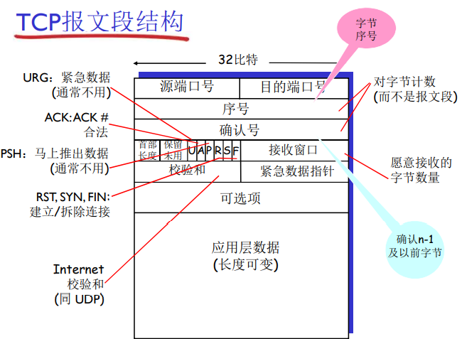

#### 1. 序号和确认号

序号：报文段首字节在字节流的编号

确认号：

- 期望从另一方收到的下一字节的序号
- 累计确认

接收方如何处理乱序的报文段——没有规定

#### 2. Telnet：序号和确认号的例子

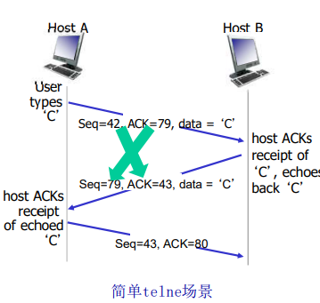

### 3.5.3 往返时间的估计与超时

Q:如何设置TCP超时？

- 比RTT要长
  - 但是RTT是发生变化的
- 太短：太早超时
  - 不必要的重传
- 太长：对报文段丢失反应太慢，消极

#### 1. 估计往返时间

- $SampleRTT$:测量从报文段发出到收到确认的时间
  - 如果又重传，忽略此次测量
- $SampleRTT$会变化，因此估计的RTT应该比较平滑
  - 对几个最近的测量值求平均，而 不是仅用当前的$SampleRTT $

计算公式：
$$
EstimatedRTT = (1-\alpha)*EstimatedRTT + \alpha*SampleRTT
$$

- 指数加权移动平均
- 过去样本的影响呈指数衰减
- 推荐值： $\alpha= 0.125$


#### 2. 设置和管理重传超时间间隔

设置超时

- $EstimatedRTT+$ 安全边界时间
  - $EstimatedRTT$变化大（方差大）-> 较大的安全边界时间
- $SampleRTT$会偏离$EstimatedRTT$多远

$$
DevRTT = (1-\beta)*DevRTT +\beta *|SampleRTT-EstimatedRTT|
$$

推荐值：$\beta = 0.25$

超时时间间隔设置：
$$
TimeoutInterval = EstimatedRTT + 4* DevRTT
$$

### 3.5.4 可靠数据链接

**TCP 在IP 不可靠服务的基础上建立了rdt**

- 管道化的报文段 
  - GBN or SR 
- 累积确认（像GBN） 
- 单个重传定时器（像GBN） 
- 是否可以接受乱序的，没有规范 

**通过以下事件触发重传** 

- 超时（只重发那个最早的未确认 段：SR） 
- 重复的确认 
  - 例子：收到了ACK50,之后又收到3 个ACK50 

#### TCP 发送方

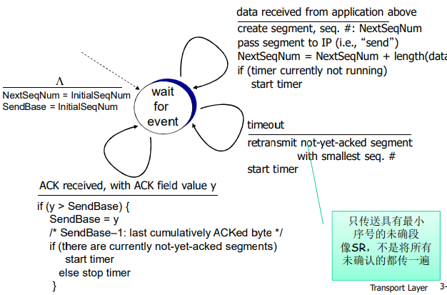

**发送方事件：**

1. 从应用层接收数据

- 用**nextseq**创建报文段 
- 序号**nextseq**为报文段首字节的字节流编号 
- 如果还没有运行，启动定时器 
  - 定时器与最早未确认的报文段关联 
  - 过去间隔:$TimeOutInterval$

2. 超时：

- 重传后沿最老的报文段 
- 重新启动定时器 

3. 收到确认

- 如果是对尚未确认的报 文段确认 
  - 更新已被确认的报文序号 
  - 如果当前还有未被确认的 报文段，重新启动定时器 

伪代码如下：

```c
NextSeqNum = InitialSeqNum
SendBase = InitialSeqNum
loop (forever) {
	switch(event) 
	event: data received from application above 
		create TCP segment with sequence number NextSeqNum 
		if (timer currently not running) 
			start timer 
		pass segment to IP 
		NextSeqNum = NextSeqNum + length(data) 
		
	event: timer timeout 
		retransmit not-yet-acknowledged segment with 
			smallest sequence number
        start timer 
        
    event: ACK received, with ACK field value of y 
		if (y > SendBase) { 
			SendBase = y
			if (there are currently not-yet-acknowledged segments) 					start timer 
		} 
} /* end of loop forever */
```

#### 产生TCP ACK的建议

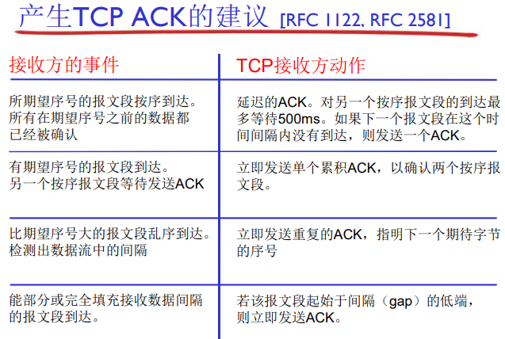

#### 快速重传

- 超时周期往往太长 
  - 在重传丢失报文段之前的 延时太长 
- 通过**重复**的ACK来检测 报文段丢失 
  - 发送方通常连续发送大量报文段 
  - 如果报文段丢失，通常会 引起多个重复的ACK 
- 如果发送方收到同一数据 的3个冗余ACK，重传最 小序号的段： 
  - 快速重传：在定时器过时 之前重发报文段 
  - 它假设跟在被确认的数据 后面的数据丢失了 
    - 第一个ACK是正常的 
    - 收到第二个该段的ACK，表 示接收方收到一个该段后的 乱序段； 
    - 收到第3，4个该段的ack，表 示接收方收到该段之后的2个 ，3个乱序段，可能性非常大 段丢失了 

算法描述：

```
event:	ACK recieved, with ACK field value of y 
			if (y>sendBase){
                sendBase = y
                if (there are currently not-yet-acknowledged segments)
                	start timer
			}
			else {
                increment count of dup ACKs received for y
                if (count of dup ACKs received for y = 3) {
                    resend segment with sequence number y
                }
			}
```


### 3.5.5 流量控制

接收方控制发送方，不让发送方发送的太多、太快以至于让接收方的缓冲区溢出，这样的操作叫做**流量控制**

- 接收方在其向发送方的TCP段 头部的rwnd字段“通告”其空闲buffer大小 
  - **RcvBuffer**大小通过socket选项设置（典型默认大小为4096字节）
  - 很多操作系统自动调整 **RcvBuffer** 
- 发送方限制未确认(“**in-flight**”)字节的个数≤接收 方发送过来的rwnd 值 
- 保证接收方不会被淹没 

缓存中可用的空间： 
$$
RcvWindow= RcvBuffer - [LastByteRcvd - LastByteRead]
$$

### 3.5.6 TCP连接管理

在正式交换数据之前，发送方和接收方握手建立通信关系: 

- 同意建立连接（每一方都知道对方愿意建立连接） 
- 同意连接参数 

#### 2次握手分析

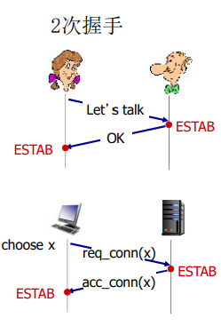

- 变化的延迟（连接请求的段没有丢，但可能超时） 
- 由于丢失造成的重传 (e.g.  req_conn(x)) 
- 报文乱序 
- 相互看不到对方 

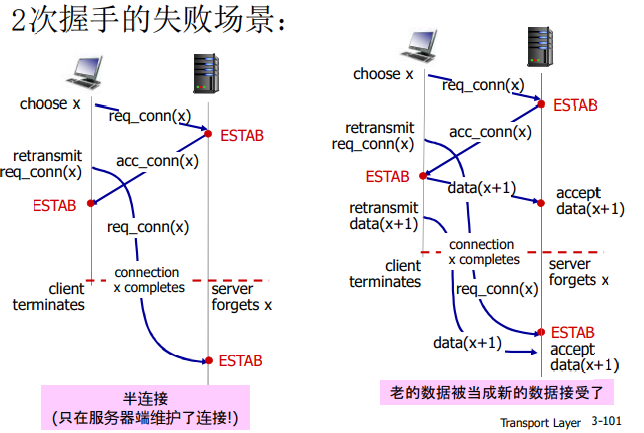


#### 3次握手情况分析

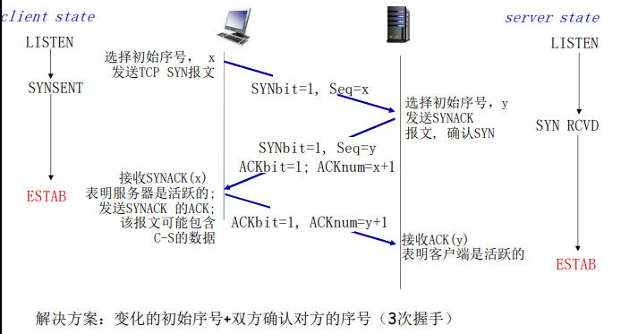

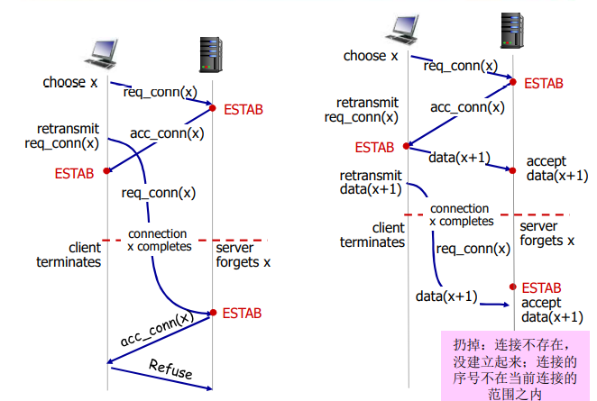

#### 三次握手FSM

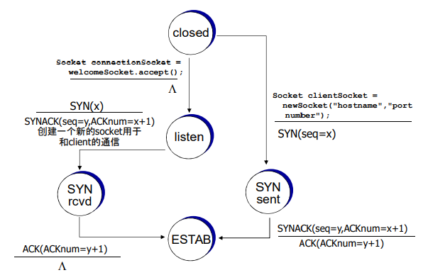

#### TCP:关闭连接

- 客户端，服务器分别关闭它自己这一侧的连接 
  - 发送FIN bit = 1的TCP段 
- 一旦接收到FIN，用ACK回应 
  - 接到FIN段，ACK可以和它自己发出的FIN段一起发 送 
- 可以处理同时的FIN交换 

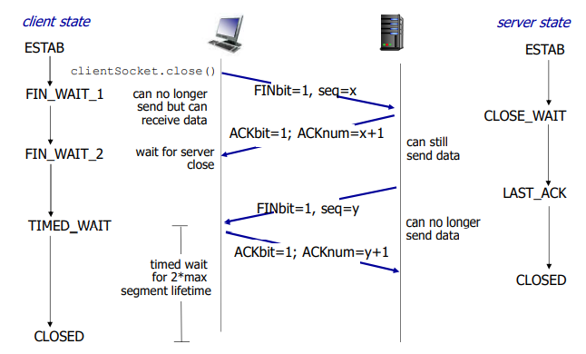

**当然这样的关闭连接并不是完美的：会出现白军对垒情况**

## 3.6 拥塞控制原理

**拥塞**

- 非正式的定义: “太多的数据需要网络传输，超过了网 络的处理能力” 
- 与流量控制不同 
- 拥塞的表现: 
  - 分组丢失 (路由器缓冲区溢出) 
  - 分组经历比较长的延迟(在路由器的队列中排队) 
- 网络中前10位的问题! 

### 3.6.1 拥塞的原因与代价

#### 情景一

- 2个发送端，2个接 收端 
- 一个路由器，具备 无限大的缓冲 
- 输出链路带宽：R  
- **没有重传** 

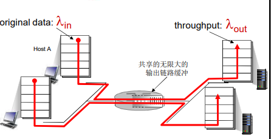


#### 场景二

- 一个路由器，**有限的**缓冲 
- 分组丢失时，发送端重传 
  - 应用层的输入=应用层输出 $\lambda_{in} =\lambda_{out}$
  - 传输层的输入包括重传: $\lambda_{in}^{''}\ge\lambda_{in}$

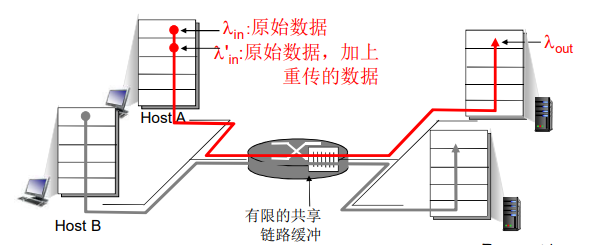

**理想化：发送端由完美的信息**

发送端知道什么时候路由器的缓冲是可用的，只在缓冲可用时发送，并且不会丢失

**理想化：掌握丢失信息**

分组可以丢失，在路由器由 于缓冲器满而被丢弃，如果知道分组丢失了，发 送方重传分组 

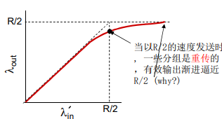

**现实情况：重复**

- 分组可能丢失，由于缓冲器 满而被丢弃 
- 发送端最终超时，发送第2 个拷贝，2个分组都被传出 

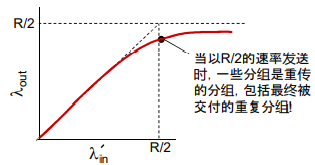

输出比输入少的原因：

- 重传的丢失分组
- 没有必要重传的重复分组

**拥塞的代价**

- 为了达到一个有效输出，网络需要做更多的工作（重传） 
- 没有必要的重传，链路中包括了多个分组的拷贝 
  - 是那些没有丢失，经历的时间比较长（拥塞状态）但是 超时的分组 
  - 降低了的“$goodput$

#### 场景三

- 4个发送端 
- 多重路径 
- 超时、重传

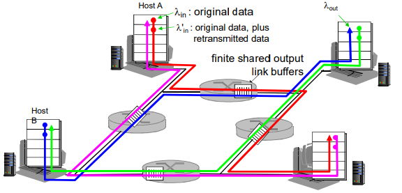

**又一个拥塞的代价：当分组丢失时，任何“关于这个分组的上游传输能力” 都被浪费了** 

### 3.6.2 拥塞控制方法

#### 端到端拥塞控制 

- 没有来自网络的显式反馈 
- 端系统根据延迟和丢失事件推断是否有拥塞 
- **TCP**采用的方法 

#### 网络辅助的拥塞控制

- 路由器提供给端系统以 反馈信息 
  - 单个bit置位，显示有 拥塞 (SNA, DECbit,  TCP/IP ECN, ATM)
  - 显式提供发送端可以 采用的速率 

#### 案例

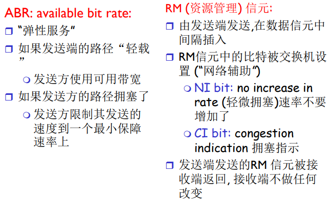

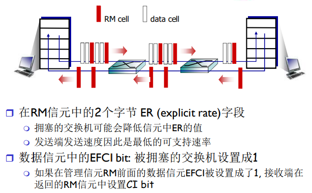

## 3.7 TCP拥塞控制

端到端的拥塞控制机制

- 路由器不向主机有关拥塞的 反馈信息 
  - 路由器的负担较轻 
  - 符合网络核心简单的 TCP/IP架构原则 
- 端系统根据自身得到的信息 ，判断是否发生拥塞，从而 采取动作 

**几个基本问题**

- 如何检测拥塞 
  - 轻微拥塞
  - 拥塞
- 控制策略
  - 在拥塞发送时如何动 作，降低速率 
    - 轻微拥塞，如何降低 
    - 拥塞时，如何降低 
  - 在拥塞缓解时如何动 作，增加速率 

#### 拥塞感知

- 某个段超时了（丢失事件 ）：拥塞
  - 超时时间到，某个段的确认没有来 
  - 原因1：**网络拥塞**（某个路由器缓冲区没空间了，被丢弃）概率**大** 
  - 原因2：**出错被丢弃了**（各级错误，没有通过校验，被丢弃）**概率小** 
  - 一旦超时，就认为拥塞了，有一定误判，但是总体控制方向是对的 
- 有关某个段的3次重复ACK：**轻微拥塞** 
  - 段的第1个ack，正常，确认绿段，期待红段 
  - 段的第2个重复ack，意味着红段的后一段收到了，蓝段乱序到达 
  - 段的第2、3、4个ack重复，意味着红段的后第2、3、4个段收到了 ，橙段乱序到达，同时红段丢失的可能性很大（后面3个段都到了， 红段都没到） 
  - 网络这时还能够进行一定程度的传输，拥塞但情况要比第一种好 

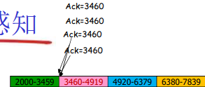

#### 速率控制方法

- 维持一个拥塞窗口的值：**CongWin** 
- 发送端限制**已发送但是未确认**的数据量（的上限）: 

$$
LastByteSent - LastByteAcked \le CongWin
$$

- 从而粗略地控制发送方的往网络中注入的速率 

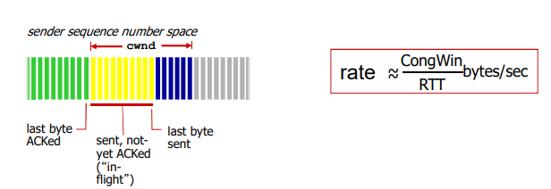

- CongWin是动态的，是感知到的网络拥塞程度的函数 
  - 超时或者3个重复ack，CongWin↓ 
    - 超时时：CongWin降为1MSS,进入SS阶段然后再倍增到 CongWin/2（每个RTT），从而进入CA阶段 
    - 3个重复ack ：CongWin降为CongWin/2,CA阶段 
  - 否则（正常收到Ack，没有发送以上情况）：CongWin跃跃欲试 
    - SS阶段：加倍增加(每个RTT) 
    - CA阶段：线性增加(每个RTT) 

#### TCP拥塞控制和流量控制的联合动作 

- 发送端控制发送但是未确认的量同时也不能够超过接收 窗口，满足流量控制要求 
  - $SendWin = min\{Congwin, RecvWin\}$
  - 同时满足拥塞控制和流量控制要求

#### 策略概述

##### 慢启动

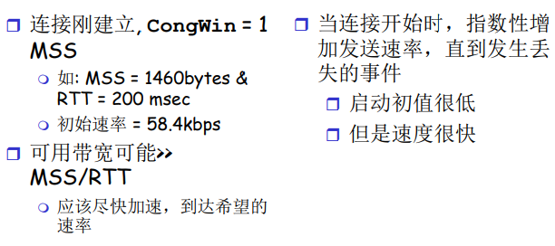

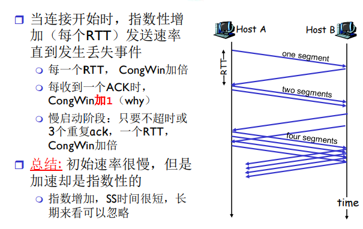


#### AIMD：线性增、乘性减少 

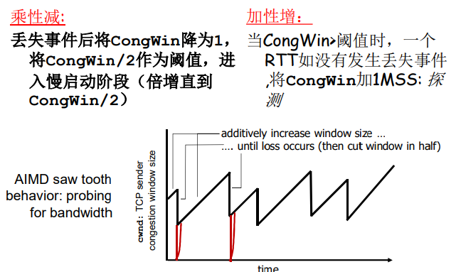

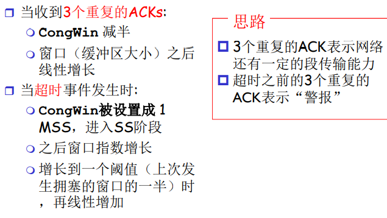

#### 情况总结

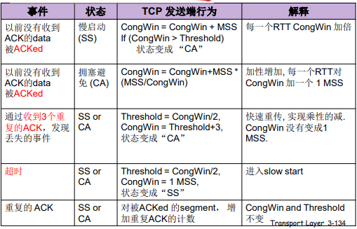

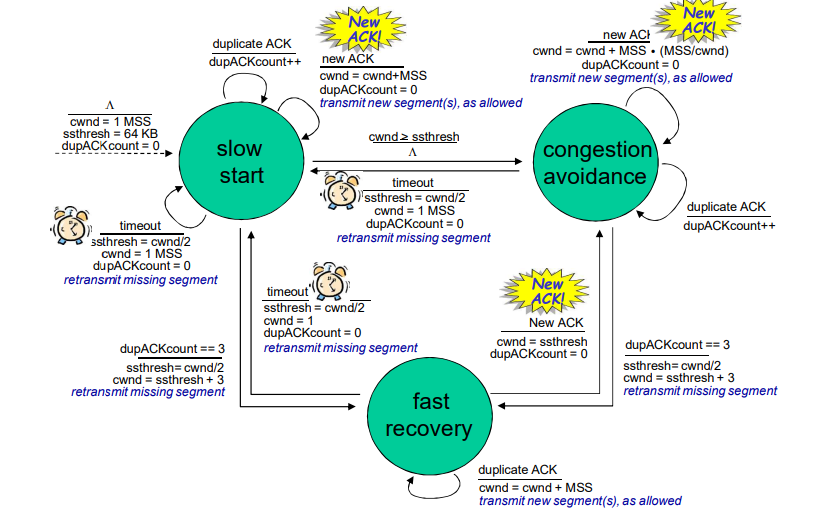

#### TCP 的吞吐量

$$
avg TCP Thrupyt = \frac{3}{4} \frac{W}{RTT} bytes/sec
$$

### 3.7.1 公平性

**公平性目标**: 如果 K个TCP会话分享一个链路带宽为R的 瓶颈，每一个会话的有效带宽为 $R/K $

**为什么TCP是公平的**

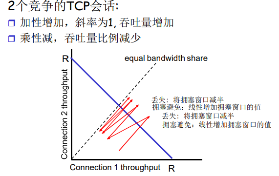

#### 1. 公平性和UDP

- 多媒体应用通常不是用 TCP 
  - 应用发送的数据速率希望 不受拥塞控制的节制 
- 使用UDP: 
  - 音视频应用泵出数据的速 率是恒定的, 忽略数据的 丢失 
- 研究领域: TCP 友好 

#### 2. 公平性和并行TCP连接

- 2个主机间可以打开多个并 行的TCP连接 
- Web浏览器 
- 例如: 带宽为R的链路支持了 9个连接;  
  - 如果新的应用要求建1个TCP连 接,获得带宽R/10 
  -  如果新的应用要求建11个TCP 连接,获得带宽R/2 

