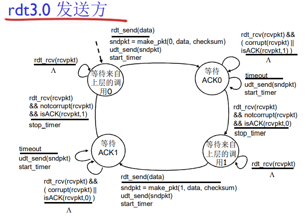

# Three-传输层

运输层位于**应用层**和**网络层**之间， 是分层的网络体系结构的重要部分。该层为运行在 同主机上的应用进程提供直接的通信服务起着至关重要的作用。

## 3.1 概述和传输层服务

运输层协议为运行在不同 机上的应用进程之间提供了 **逻辑通信(logic communication)**,并且运输层的协议是在端系统中实现的而不是在网络核心中。在发送端，运输 将从发送应用程序进程接收到的报文转换成运输层分组，用因特网术语来讲该分组称为 运输层报文段 (**segment**).并且有多个传输层协议可供选择：**Internet**: $TCP$和$UDP$

### 3.1.1 传输层和网络层的关系

- 网络层的服务：主机之间的逻辑通信
- 传输层的服务：进程之间的逻辑通信
  - 依赖于网络层的服务
    - 延时、带宽
  - 并且对网络层的服务进行增强
    - 数据丢失、顺序混乱、加密

有些服务是可以加强的：不可靠->可靠、安全

但有些服务是不可以被加强的：带宽、延迟

### 3.1.2 Internet传输层概述

- 可靠的、保序的传输： $TCP$
  - 多路复用、解复用
  - 拥塞控制
  - 流量控制
  - 建立连接
- 不可靠、不保序的传输： $UDP$
  - 多路复用、解复用
  - 没有为尽力而为的$IP$服务添加更多的其他额外的服务
- 都不提供的服务：
  - 延时保证
  - 带宽保证

## 3.2 多路复用与解复用

#### 多路解复用工作原理

- 解复用作用：$TCP$或者$UDP$实体采用哪些信息，将报文段的数据部分交给正确的$socket$，从而交给正确的进程
- 主机收到$IP$数据报
  - 每个数据报有源$IP$地址和目标地址
  - 每个数据报承载一个传输层报文段
  - 每个报文段有一个源端口号和目标端口号，（特定应用有著名的端口号）
- 主机联合使用**IP地址**和**端口号**将报文段发送给合适的套接字

#### 无连接(**UDP**)多路解复用

- 创建套接字：
- 在接收端，$UDP$套接字用二元组标识**(目标IP地址、目标端口号)**
- 当主机收到$UDP$报文段
  - 检查报文段的目标端口号
  - 用该端口号将报文段定位给套接字
- 如果两个不同$IP$地址/源端口号的数据包，但是有**相同的目标$IP$地址和端口号**，则被定位到相同的套接字

#### 面向连接(TCP)的多路解复用

- TCP套接字：四元组本地标识
  - 源IP地址
  - 源端口号
  - 目标IP地址
  - 目标端口号
- **解复用**：接收主机用这四个值来将数据报定位到合适的套接字
- 服务器能够在一个TCP端口上同时支持多个TCP套接字： 
  - 每个套接字由其四元组标 识（有不同的源**IP**和源**PORT**） 
- Web服务器对每个连接 客户端有不同的套接字 
  - 非持久对每个请求有不同的套接字 

## 3.3 无连接传输：UDP

“尽力而为”的服务，报文可能发生丢失、送到应用进程的报文段乱序

**无连接**

- UDP发送端和接收端之间没有握手
- 每个UDP报文段都被独立的处理

UDP常用于：

- 流媒体（丢失不敏感，速率敏感，应用可控制传输速率）
- DNS
- SNMP

在**UDP**上可行可靠的传输需要在应用层增加可靠性，应用特定的差错恢复

#### UDP存在的原因

- 关于发送什么数据以及何时发送的应用层控制更为精细
- 无需建立连接
- 无连接状态：在发送端和接收端没有连接状态
- 分组首部开销小
- 无拥塞控制和流量控制，可以尽可能块的发送报文段

### 3.3.1 UDP报文段结构

### 3.3.2 UDP 检验和

**目标**：检测在被传输报文段中的差错

发送方：

- 将报文段的内容视为16bit的整数
- 检验和：报文段的加法和（1的补运算）
- 发送方将检验和放在UDP的校验和字段

接收方：

- 计算接收到的报文段的校验和
- 检查计算出的校验和与校验 和字段的内容是否相等： 
  - 不相等–--检测到差错 
  - 相等–--没有检测到差错 ，但也许还是有差错 
    - 残存错误 （就是错的惊人的一致）

注意：当数字相加时，**在最高位的进位要回卷，再加到结果上** 

例子如下：

## 3.4 可靠数据传输的原理

可靠数据传输协议（**reliable data transfer protocol**）,**RDT**在应用层、传输层和数据链路层都很重要.

### 3.4.1 构建可靠数据传输协议

#### 问题描述

我们将

- 渐增式地开发可靠数据传输协议（ rdt ）的发送方和接 收方 
- 只考虑单向数据传输
  - 但是控制信息是双向流动的
- 双向的数据传输问题实际上是2个单向数据传输问题的综合 
- 使用有限状态机 (FSM) 来描述发送方和接收方 

#### 1 在可靠信道上的可靠数据传输 Rdt 1.0

**假设**

- 下层的信道是完全可靠的
  - 没有比特出错
  - 没有分组的丢失
- 发送方和接收方的FSM
  - 在可靠信道上的可靠数据传输 
  - 接收方从下层信道接收数据 

#### 2 具有比特差错的信道 Rdt 2.0->Rdt 2.2

##### rdt 2.1: 起步

**假设**

- 下层信道可能会出错：将分组中的比特翻转 
  - 用校验和来检测比特差错 
- 问题：怎样从差错中恢复： 
  - **确认(ACK)**：接收方显式地告诉发送方分组已被正确接收
  - **否定确认( NAK):** 接收方显式地告诉发送方分组发生了差错，发送方收到NAK后，发送方重传分组 
-  **rdt2.0**中的新机制：采用差错控制编码进行差错检测 
  - 发送方差错控制编码、缓存 
  - 接收方使用编码检错 
  - 接收方的反馈：控制报文（ACK，NAK）：接收方->发送方 
  - 发送方收到反馈相应的动作 

##### rdt 2.1: 一些改进

如果ACK/NAK出错？

- 发送方不知道接收方发 生了什么事情！ 
- 发送方如何做 
  - 重传？可能重复 
  - 不重传？可能死锁(或出 错) 
- 需要引入新的机制 
  - 序号 

处理重复：

- 发送方在每个分组中加 入序号 
- 如果ACK/NAK出错，发 送方重传当前分组 
- 接收方丢弃（不发给上 层）重复分组 

##### rdt 2.2: 无NAK的协议

- 功能同rdt2.1，但只使用ACK（ack要编号）
- 接收方对最后正确接收的分组发ACK，以替代NAK 
  - 接收方必须显式地包含被正确接收分组的序号 
- 当收到重复的ACK（如：再次收到ack0）时，发送 方与收到NAK采取相同的动作：重传当前分组 
- 为后面的一次发送多个数据单位做一个准备 
  - 一次能够发送多个 
  - 每一个的应答都有：ACK，NACK；麻烦 
  - 使用对前一个数据单位的ACK，代替本数据单位的nak 
  - 确认信息减少一半，协议处理简单 

#### 3 具有比特差错和分组丢失的信道 Rdt 3.0

**新的假设**： 下层信道可能会丢失分组（数据或ACK） 

- 会死锁
- 机制还不够处理这种情况
  - 检验和
  - 序列号
  - ACK
  - 重传

方法：发送方等待ACK一段合理的时间 

- 发送端超时重传：如果到时没有 收到ACK->重传 
- 问题：如果分组（或ACK ）只 是被延迟了： 
  - 重传将会导致数据重复，但 利用序列号已经可以处理这 个问题 
  - 接收方必须指明被正确接收 的序列号 
- 接收方必须指明被正确接收 的序列号 

**链路层的timeout时间确定的 传输层timeout时间是适应式的** 

##### rdt 3.0 运行

上述讨论的就是停止等待协议**（stop-and-wait）**

### 3.4.2 流水线可靠数据传输协议

#### rdt 3.0 性能分析

经过上面分析可以看出来，**瓶颈**在于：网络协议限制了物理资源的利用！

那么不妨采用**流水线**来**提高链路利用率**

- 增加$n$，能提高链路利用率
- 但是当达到某个$n$，其$u = 100\%$ 时，无法再通过增加$n$，提高利用率
- 瓶颈转移到了-》链路带宽

#### 基本概述

**流水线**：允许发送方再**未得到对方确认**的情况下一次发送多个分组

- 必须增加序号的范围:用多个bit表示分组的序号 
- 在发送方/接收方要有缓冲区 
  - 发送方缓冲：未得到确认，可能需要重传； 
  - 接收方缓存：上层用户取用数据的速率≠接收到的数据速率；接收到的数据可 能乱序，排序交付（可靠） 
- 两种通用的流水线协议： **回退$N$步（GBN）**和**选择重传(SR)**

### 3.4.3 回退N步

在此协议中，允许发送方发送多个分组（当有多个分组可用时）而不需等待确认，但它受限于在流水线中未确认的分组数不能超过某个最大允许数Ｎ

#### 通用：滑动窗口(**slide window**)协议

- 发送缓冲区
  - 形式：内存中的一个区域，落入缓冲区的分组可以发送 
  - 功能：用于存放已发送，但是没有得到确认的分组 
  - 必要性：需要重发时可用
- 发送缓冲区的大小：一次最多可以发送多少个未经确认的分组
  - stop and wait 协议 = 1
  - popline 协议 >1,合理的值不能很大，链路利用率不能超过$100\%$
- 发送缓冲区中的分组 
  - **未发送的**：落入发送缓冲区的分组，可以连续发送出去
  - **已经发送出去的、等待对方确认的分组**：发送缓冲区的分组只有得到确认 才能删除 

##### 发送窗口滑动过程-相对表示方法

- 采用相对移动方式表示，分组不动
- 可缓冲范围移动，代表一段可以发送的分组

##### 实现过程描述

- 一开始：没有发送任何一个分组

  - 后沿 = 前沿
  - 之间为发送窗口的尺寸 = 0

- 每发送一个分组，前沿前一个单位

  

- 发送窗口前沿移动的极限：不能够超过发送缓冲区

- 发送窗口后沿移动

  - 条件：收到老分组的确认
  - 结果：发送缓冲区罩住新的分组，来了分组可以发 送 
  - 移动的极限：不能超过前沿

##### 接收窗口

接受窗口 (**receiving window)** = 接收缓冲区

- 接收窗口用于控制哪些分组可以接收
  - 只有收到的分组序号落入接收窗口内才允许接收 
  - 若序号在接收窗口之外，则丢弃 
- 接收窗口尺寸Wr=1，则只能顺序接收 
- 接收窗口尺寸Wr>1 ，则可以乱序接收
  - 但提交给上层的分组，要按序 

##### 接受窗口的滑动和确认

**滑动**

- 低序号的分组到来，接收窗口移动； 
- 高序号分组乱序到，缓存但不交付（因为要实现rdt，不允许失序），不滑动 

**发送确认**

- 接收窗口尺寸=1 ：发送连续收到的最大的分组确认（累计确认） 
- 接收窗口尺寸>1 ：收到分组，发送那个分组的确认（非累计确认） 

##### 正常情况下的2个窗口互动

- 发送窗口
  - 有新的分组落入发送缓冲区范围，发送->前沿滑动 
  - 来了老的低序号分组的确认->后沿向前滑动->新的分组可 以落入发送缓冲区的范围 
- 接受窗口
  - 收到分组，落入到接收窗口范围内，接收 
  - 是低序号，发送确认给对方
- 发送端上面来了分组->发送窗口滑动->接收窗口滑动->发确认 

#### GBN异常情况下的2窗口互动

- 发送窗口
  - 新分组落入发送缓冲区范围，发送->前沿滑动 
  - 超时重发机制让发送端将发送窗口中的所有分组发送出去 
  - 来了老分组的重复确认->后沿不向前滑动->新的分组无法 落入发送缓冲区的范围（此时如果发送缓冲区有新的分组 可以发送） 
- 接收窗口
  - 收到乱序分组，没有落入到接收窗口范围内，抛弃 
  - （重复）发送老分组的确认，累计确认； 

##### 发送方扩展的FSM

##### 接收方扩展的FSM

- 只发送ACK：对顺序接收的最高序号的分组 
  - 可能会产生重复的ACK 
  - 只需记住expectedseqnum；接收窗口=1 即只一个变量就可表示接收窗口 
- 对乱序的分组： 
  - 丢弃（不缓存） $\rightarrow$ 在接收方不被缓存！ 
  - 对顺序接收的最高序号的分组进行确认-累计确认 

### 3.4.4  选择重传SR（select repeat）

- 接收方对每个正确接收的分组，分别发送ACK （非累计确认）
  - 接收窗口>1
    - 可以缓存乱序的分组 
  - 最终将分组按顺序交付给上层 
- 发送方只对那些没有收到ACK的分组进行重 发-选择性重发 
  - 发送方为每个未确认的分组设定一个定时器 
- 发送窗口的最大值（发送缓冲区）限制发送 未确认分组的个数 

##### 发送方

从上层接收数据

- 如果下一个可用于该分组的序 号可在发送窗口中，则发送

**timeout(n)**:重新发送分组n，重新设定定时器 
**ACK(n)**  **in [sendbase,sendbase+N]** 

- 将分组n标记为已接收 
- 如n为最小未确认的分组序号， 将base移到下一个未确认序号 

##### 接收方

**分组n [rcvbase, rcvbase+N-1]**

- 发送**ACK(n)**
- 乱序：缓存
- 有序：该分组及以前缓存的 序号连续的分组交付给上层 ，然后将窗口移到下一个仍未被接收的分组 

**分组  [rcvbase-N, rcvbase-1]** 

- ACK(n)

**其它**:

- 忽略该分组

#### 对比 GBN 和 SR

**适用范围**

- 出错率低：比较适合**GBN**，出错非常罕见，没有必 要用复杂的**SR**，为罕见的事件做日常的准备和复杂处理 
- 链路容量大（延迟大、带宽大）：比较适合**SR**而不是**GBN**，一点出错代价太大 

**GBN**: $2^n -1$

**SR**:$2^{n-1}$

3.5 面向连接的传输：$TCP$

异常情况下SR的2窗口互动 

- 发送窗口

  - 新分组落入发送缓冲区范围，发送->前沿滑动 
  - 超时重发机制让发送端将超时的分组重新发送出去 
  - 来了乱序分组的确认->后沿不向前滑动->新的分组无法落 入发送缓冲区的范围（此时如果发送缓冲区有新的分组可 以发送） 

- 接受窗口

  - 收到乱序分组，落入到接收窗口范围内，接收 
  - 发送该分组的确认，单独确认 

  

